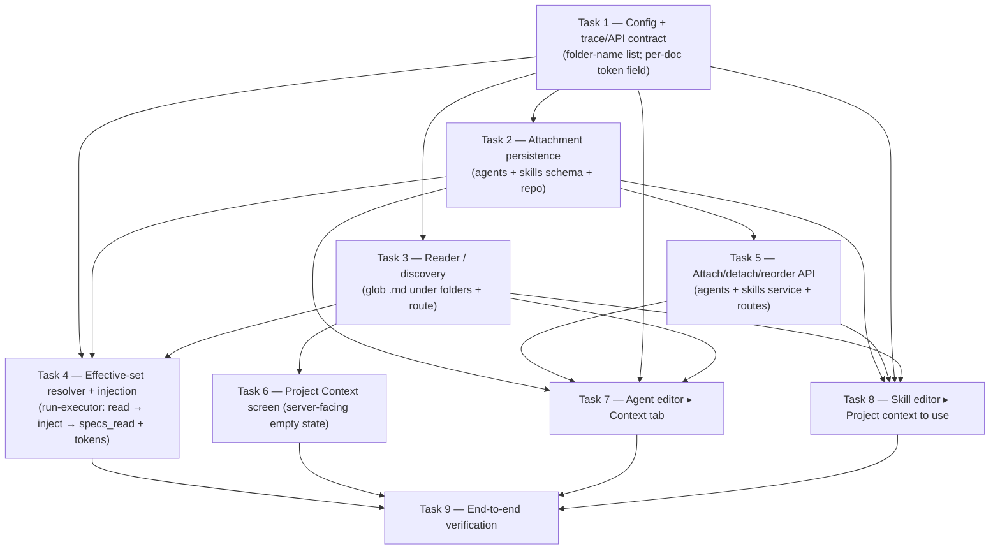

# Plan: Project Context  |  Plan ID: PLAN-01  |  Status: done
Implements: [SPEC-01](../specs/SPEC-01-project-context.md)

## Goal / Context

Make any markdown under a `specs`/`docs`/`insights` folder **attachable context** for the
agents and skills it is attached to, so a spec stops being a passive human document and starts
steering the reviewer. The reviewer-core prompt slot and the trace contract **already exist** —
the untrusted `specs?: string[]` param renders the `## Project context` block via `wrapUntrusted`
under `INJECTION_GUARD` (`reviewer-core/src/prompt.ts:57,133-136,153`), and the trace already
carries `PromptAssembly.specs` + `RunTrace.specs_read: string[]`
(`server/src/vendor/shared/contracts/trace.ts:45,101`), currently hard-coded empty in the
executor (`server/src/modules/reviews/run-executor.ts:334,652`). So this work is mostly
**wiring**, not new contract design: a reader (glob `.md` under the three folders), attach/detach
persistence on the agent + skill side, a run-time effective-set resolver, injection into the
existing slot, and populating `specs_read[]` + per-doc token counts. **Zero new LLM calls** — all
deterministic I/O.

## Execution mode

**Confirmed: single-agent (one sequential pass) — user-confirmed 2026-07-10.**

Rationale: the feature is genuinely cross-cutting (server reader + persistence + executor
injection + trace + two client editor surfaces), but the tasks form a **dependency-heavy spine
with narrow fan-out**, not a wide independent graph. The persistence shape (Task 2: the
attachment columns/join on `agents`/`skills`) is the shared contract that the reader-facing API,
the resolver, and *both* client editors all read or write — almost every other task is gated on
it. Beyond that gate the only true parallelism is Task 3 (reader/discovery) vs Task 4 (resolver +
injection), and the two client tasks (7, 8) which share `client/src/lib` API/hook files and the
vendored contract copy (so they contend on shared files, not cleanly parallel). Given that the
real critical path is a chain and the parallel branches are shallow and file-contended, a single
implementer executing the ordered spine avoids merge contention on the shared persistence
migration, the shared `lib/api.ts`/hooks, and the vendored client contract copy — while still
honoring single-owner ordering. **If you prefer multi-agent**, the safe parallel split is: after
Tasks 1+2 land, run {Task 3} ∥ {Task 4→5→6 as one owner} ∥ {Task 7→8 as one owner}; do **not**
parallelize Task 7 against Task 8 (shared files).

Task-graph structure below is authored to honor this: a sequential spine
(1 → 2 → {3, 4} → 5 → 6) with the client surfaces (7, 8) gated on Task 2's persistence + Task 1's
contract, and Task 9 (verification) last.

## Affected modules

| Module | Stack | Relevant insights (top-3) |
|--------|-------|---------------------------|
| `server/` | Fastify 5 + Drizzle/Postgres | (1) `agent_skills` has no `workspace_id`; filter skill-inherited reads by `skills.workspace_id` — the `linkedSkills` query already does (`repository.ts:199`), reuse it (INSIGHTS 2026-06-29). (2) Windows `path.isAbsolute('/x')` is `false`; author-controlled path guards must also test `/^[/\\]/` and `/^[a-zA-Z]:/` — precedent at `run-executor.ts:428-430` (INSIGHTS 2026-07-05). (3) Read-time features compose persisted data with zero LLM; keep enrichment best-effort + OUTSIDE `failAll` (INSIGHTS 2026-07-04/07-05). |
| `client/` | Next.js 15 + React 19 | (1) Vendored `client/src/vendor/shared/` is a copy with **no sync script** — after editing the server contract, `cp` it to the client copy in the same task (INSIGHTS 2026-06-20). (2) All TanStack Query keys go through the `qk` factory; a query and its `invalidateQueries` must build from `qk` or they drift (INSIGHTS 2026-06-29, `lib/query-keys.ts:13`). (3) Client `.ts`/`.tsx` are CRLF and `pnpm typecheck` exit code can be masked by piping — verify with `pnpm typecheck; echo "EXIT=$?"` (INSIGHTS 2026-06-29). |
| `reviewer-core/` | pure engine | (1) The `specs` slot already wraps each doc in `wrapUntrusted` under `INJECTION_GUARD`; injection defense is the guard, **not** keyword scanning — do not add a denylist (AGENTS + prompt.ts:16-28,133-136). (2) No side effects beyond `LLMProvider` — file reads happen in the server, never here (AGENTS "Don't add side effects"). (3) Whenever a field is added to the assembly object, sync `PromptAssembly` in both trace.ts copies — but this feature adds **no** new engine field, so no reviewer-core change is needed (INSIGHTS 2026-07-06). |

## Requirements coverage

| Requirement / AC | Owning task(s) | Status (covered / gap) |
|------------------|----------------|------------------------|
| AC-1  (reader returns every `.md` under specs/docs/insights, repo-relative path) | Task 3 | covered |
| AC-2  (folder-name list from config, not hard-coded at call site) | Task 1, Task 3 | covered |
| AC-3  (no matching folder → empty list + empty-state screen, no error) | Task 3, Task 6 | covered |
| AC-4  (attach to agent persists path only; survives reload) | Task 2, Task 5, Task 7 | covered |
| AC-5  (attach to skill persists path only; survives reload) | Task 2, Task 5, Task 8 | covered |
| AC-6  (reorder agent docs persists order; run renders in stored order) | Task 2, Task 4, Task 5, Task 7 | covered |
| AC-7  (detach removes path; later run does not read/inject it) | Task 2, Task 4, Task 5 | covered |
| AC-8  (effective set = agent-attached ∪ enabled-skill-inherited; agent-first ordering) | Task 4 | covered |
| AC-9  (dedup by repo-relative path; kept in agent-attached position) | Task 4 | covered |
| AC-10 (globally-disabled skill contributes nothing) | Task 4 | covered |
| AC-11 (executor reads each doc, passes into `reviewPullRequest` → untrusted `## Project context`) | Task 4 | covered |
| AC-12 (empty set → slot omitted → prompt byte-identical to today) | Task 4 | covered |
| AC-13 (zero new LLM calls; resolution/read/token-count deterministic) | Task 3, Task 4 | covered |
| AC-14 (populate `RunTrace.specs_read` with paths actually read + injected) | Task 4 | covered |
| AC-15 (per-injected-doc token size via `container.tokenizer.count`) | Task 4 | covered |
| AC-16 (missing/unreadable doc → skip + Live Log line, never fail; not in `specs_read`) | Task 4 | covered |

All 16 acceptance criteria have an owning task. No coverage gaps.

## Shared contracts & do-not-touch

- **Shared contract (read-only for workers; owned by the tasks that change it):**
  - Prompt boundary `specs?: string[]` on `assemblePrompt`/`reviewPullRequest`
    (`reviewer-core/src/prompt.ts:57,133-136,153`) — **used as-is, not changed.** No reviewer-core
    task exists; do not edit `reviewer-core/**`.
  - Trace shape `PromptAssembly.specs` + `RunTrace.specs_read`
    (`server/src/vendor/shared/contracts/trace.ts:45,101`) — **already present**, only *populated*
    by Task 4. Per-doc token sizes need a **new nullish field** on a contract (Task 1) if the
    trace should carry them structurally; otherwise reuse the existing `skill_tokens` precedent
    shape. Task 1 owns any contract edit and its vendored-copy propagation.
  - Attachment-storage shape on `agents`/`skills` (Task 2) — the persistence contract every
    downstream task reads. Precedents: `agent_skills(agent_id, skill_id, order)`
    (`server/src/db/schema/agents.ts:51-63`) and `skills.evidenceFiles jsonb $type<string[]>()`
    (`server/src/db/schema/skills.ts:19`).
- **Do-not-touch:**
  - `server/src/db/migrations/**` — generated. Edit `db/schema/`, then `pnpm db:generate` (Task 2).
  - `client/src/vendor/shared/**` — vendored copy. Edit the server source of truth, then `cp` to
    the client copy (no sync script exists). Only the copy-propagation is allowed, in the same task.
  - Lockfiles (`pnpm-lock.yaml`, `package-lock.json`); do not mix pnpm/npm per package.
  - `reviewer-core/**` — no change needed; the slot and guard already exist. Do not add file reads
    or keyword scanning there.

## Task graph

Parallel-safe (multi-agent) only if grouped by owner: `{T3}` ∥ `{T4→...}` ∥ `{T7→T8}` after
T1+T2. T7 and T8 are **sequential to each other** (shared `client/src/lib/api.ts`, hooks, vendored
contract copy). In the recommended single-agent mode the whole chain runs in the numbered order.

## Tasks

| # | Title | Owner path(s) | Domain | Skills | Depends-on | Parallel? | Success check |
|---|-------|---------------|--------|--------|------------|-----------|---------------|
| 1 | Config + trace/API contract | `server/src/platform/config.ts`, `server/src/vendor/shared/contracts/trace.ts` (+ context/project-context contract), `client/src/vendor/shared/**` (cp only) | Shared contracts / backend | zod, typescript-expert (+ security) | — | n/a | `pnpm typecheck` (server), `cp` verified |
| 2 | Attachment persistence | `server/src/db/schema/agents.ts`, `server/src/db/schema/skills.ts`, `server/src/modules/{agents,skills}/repository.ts` | DB schema / backend | onion-architecture, drizzle-orm-patterns, postgresql-table-design, zod, typescript-expert, security | 1 | n/a | `pnpm db:generate` clean + `pnpm exec vitest run .it.test` |
| 3 | Reader / discovery | `server/src/adapters/git/simple-git.ts` (+ port in `vendor/shared/adapters.ts`), `server/src/modules/project-context/**` (new module) | Backend | onion-architecture, fastify-best-practices, zod, typescript-expert, security | 1 | ∥ with 4 | `pnpm exec vitest run` (unit) + `.it.test` |
| 4 | Effective-set resolver + injection | `server/src/modules/reviews/run-executor.ts` (+ `server/src/modules/reviews/project-context.ts` new pure/compose) | Backend | onion-architecture, security, zod, typescript-expert | 1, 2, 3 | ∥ with 3 | `pnpm exec vitest run` (unit) + `.it.test` |
| 5 | Attach/detach/reorder API | `server/src/modules/{agents,skills}/{service,routes}.ts` | Backend | onion-architecture, fastify-best-practices, zod, typescript-expert, security | 2 | after 2 | `pnpm exec vitest run .it.test` |
| 6 | Project Context screen | `client/src/app/**` (new route/page), hooks in `client/src/lib/hooks/**` | UI | frontend-architecture, react-best-practices, next-best-practices, typescript-expert, security, zod (+ react-testing-library) | 1, 3 | after 3 | `pnpm test` + `pnpm build` (client) |
| 7 | Agent editor ▸ Context tab | `client/src/app/agents/[id]/_components/AgentEditor/**`, `client/src/lib/{api.ts,hooks/**}` | UI | frontend-architecture, react-best-practices, next-best-practices, typescript-expert, security, zod (+ react-testing-library) | 1, 2, 5 | after 5; **serial with 8** | `pnpm test` + `pnpm build` (client) |
| 8 | Skill editor ▸ Project context to use | `client/src/app/skills/_components/SkillsPageView/SkillEditor.tsx` (+ panel), `client/src/lib/{api.ts,hooks/**}` | UI | frontend-architecture, react-best-practices, next-best-practices, typescript-expert, security, zod (+ react-testing-library) | 1, 2, 5 | after 5; **serial with 7** | `pnpm test` + `pnpm build` (client) |
| 9 | End-to-end verification | — (read-only run of suites) | Verification | (n/a — runs commands) | 4, 6, 7, 8 | last | all per-module suites green |

Every affected code file has a **single owner**. In single-agent mode this is inherent; in
multi-agent mode note the two contention edges: Tasks 7 and 8 both write `client/src/lib/api.ts`
and hooks, so they must run under one owner sequentially (not in parallel).

## Task detail

### Task 1 — Config + trace/API contract
- **Intent:** Establish the two contract-level facts every other task reads, in one owned place so
  nothing else edits contracts. (a) Add the `specs`/`docs`/`insights` **folder-name list to
  `AppConfig`** so the reader takes it from config, not a hard-coded call site (AC-2, D2: global
  `AppConfig`). (b) Add the shape needed to expose **per-injected-document token sizes** in the
  trace (AC-15) — either a new `nullish` field on `RunTrace`/`PromptAssembly`
  (`trace.ts`) modelled on `skill_tokens` (`trace.ts:43`), or a small `project-context` contract
  for the reader's list response (AC-1/AC-3) and the attach payloads. Keep new `RunSummary`/trace
  fields `.nullable().optional()` where the repo layer can't fill them (server INSIGHTS 2026-06-20).
- **Files:**
  - `server/src/platform/config.ts` — add `contextFolderNames: string[]` (default
    `['specs','docs','insights']`), parsed from an optional env var like other flags
    (`config.ts:15-39,64-81`). Global, not per-workspace (D2).
  - `server/src/vendor/shared/contracts/trace.ts` — if token sizes are carried structurally, add a
    `nullish` field mirroring `skill_tokens` (`trace.ts:43`); **do not** rename the existing
    `specs`/`specs_read` fields (`:45,101`).
  - New/extended contract for the reader list + attach payloads (repo-relative path strings) — Zod,
    routes are schema-first via `fastify-type-provider-zod` (server AGENTS "Non-default conventions").
  - `client/src/vendor/shared/contracts/*.ts` — **`cp` the edited server copy** (no sync script;
    INSIGHTS 2026-06-20). This is the only allowed touch of the vendored copy, in this task.
- **Skills to apply:** zod, typescript-expert, security (from `skill-routing`: *Shared contracts*
  group `server/src/vendor/shared/**` → zod + typescript-expert; config is *Backend*).
- **Insights to honor:** New enriched trace fields must be `.nullish()`/`.optional()` so the repo
  layer compiles (server INSIGHTS 2026-06-20). The vendored client copy has no sync script — `cp`
  after editing (INSIGHTS 2026-06-20).
- **Wrap-up:** `capturing-insights` — note any non-obvious contract decision.
- **Acceptance test:** `pnpm typecheck` (server) green; the client copy is byte-identical to the
  server source for the edited file(s).

### Task 2 — Attachment persistence (agents + skills)
- **Intent:** Persist **paths only** (not doc text), ordered, workspace-scoped, on both the agent
  and skill sides — the storage contract every downstream task reads (AC-4, AC-5, AC-6 ordering).
- **Files:**
  - `server/src/db/schema/agents.ts` + `server/src/db/schema/skills.ts` — add the attachment
    storage. **Implementer's choice** between the two real precedents: a
    `agent_context_docs(agent_id, path, order)` / `skill_context_docs(skill_id, path, order)` join
    (mirrors `agent_skills` at `agents.ts:51-63`, gives ordering + reorder for free) **or** a
    `jsonb $type<string[]>()` column (mirrors `skills.evidenceFiles` at `skills.ts:19`, simpler but
    order = array order). Prefer the **join** for the agent side because AC-6 requires reorder
    persistence and a stable `order` column matches the existing `agent_skills` reorder pattern.
  - Then `pnpm db:generate` to produce the migration — **never hand-edit
    `server/src/db/migrations/**`** (global do-not-touch).
  - `server/src/modules/agents/repository.ts` + `server/src/modules/skills/repository.ts` — read/
    write methods for the attachment set, ordered by `order` asc (mirror `linkedSkills` at
    `agents/repository.ts:194-202`).
- **Skills to apply:** onion-architecture, drizzle-orm-patterns, postgresql-table-design, zod,
  typescript-expert, security (from `skill-routing`: *DB schema* group adds drizzle-orm-patterns +
  postgresql-table-design on top of *Backend*).
- **Insights to honor:** If using a join table, it (like `agent_skills`) will have **no
  `workspace_id`** — every read must filter by the owning row's `workspace_id` (the skill side by
  `skills.workspace_id`, exactly as `linkedSkills` does at `agents/repository.ts:199`) or leak
  cross-workspace context (server INSIGHTS 2026-06-29). Migrations are generated — do not hand-edit
  (global do-not-touch).
- **Wrap-up:** `capturing-insights`.
- **Acceptance test:** `pnpm db:generate` produces a clean migration; a `.it.test.ts` round-trips
  attach → read-back ordered (testcontainers) — `pnpm exec vitest run .it.test`.

### Task 3 — Reader / discovery
- **Intent:** Discover, in the cloned repo, every `.md` file under a folder named `specs`/`docs`/
  `insights` at any depth (glob `**/{specs,docs,insights}/**/*.md`), each with its repo-relative
  path; expose them on a route for the Project Context screen (AC-1, AC-2, AC-3, AC-13).
- **Files:**
  - `server/src/vendor/shared/adapters.ts` — the `GitClient` port has `readFile` + `clonePathFor`
    but **no directory-list/glob** (`adapters.ts:208-231`). Add a `listFiles`/`listDocs(repo,
    globs)` method to the port (the tenant-safe, containment-checked place), or implement the glob
    in the new module using `clonePathFor` + a filesystem walk. Prefer a port method for symmetry
    with `readFile` and so the containment/symlink rules live with the adapter.
  - `server/src/adapters/git/simple-git.ts` — implement it. **Reuse the containment precedent**:
    `readFile` resolves under `clonePathFor` and asserts `resolved.startsWith(base + sep)`
    (`simple-git.ts:129-138`). Apply the same base-prefix check to each discovered path; **do not
    follow symlinks out of the tree** (spec edge case: symlinked `specs`/`docs`/`insights`).
  - `server/src/modules/project-context/**` — **new module** (`routes.ts` · `service.ts`),
    registered in `server/src/modules/index.ts`. Route is schema-first (Zod contract from Task 1).
    Take the folder-name list from `config.contextFolderNames` (Task 1), **not** hard-coded at the
    call site (AC-2). Empty repo → empty list, no error (AC-3). Follow the "pure core + thin DB/IO
    service" shape (server INSIGHTS 2026-07-05, Smart Diff): a testable glob→paths function + a thin
    service. Zero LLM (AC-13).
- **Skills to apply:** onion-architecture, fastify-best-practices, zod, typescript-expert, security
  (from `skill-routing`: *Backend*; the adapter edit is also *Backend*).
- **Insights to honor:** Reuse the adapter-level containment check as the primary defence
  (`simple-git.ts:129-138`); on Windows also guard rooted/`/`-leading and drive-letter paths with
  `/^[/\\]/` + `/^[a-zA-Z]:/` if any secondary filter on the returned paths is added (server
  INSIGHTS 2026-07-05). Do not follow symlinks out of the repo tree.
- **Wrap-up:** `capturing-insights`.
- **Acceptance test:** unit test the glob→paths core over a fixture tree (empty tree → `[]`;
  nested `docs/a/b.md` discovered; a `.txt` and a file outside the three folders excluded); route
  `.it.test` returns repo-relative paths. `pnpm exec vitest run`.

### Task 4 — Effective-set resolver + injection (run-executor)
- **Intent:** The core of the feature. On a run, compute the effective document set, read each
  file, inject into the existing untrusted `## Project context` slot, populate `specs_read[]` +
  per-doc token sizes, and never fail the run on a bad path (AC-6..AC-16).
- **Files:**
  - `server/src/modules/reviews/project-context.ts` — **new pure/compose fn** (mirrors Smart Diff's
    pure `compose.ts`, server INSIGHTS 2026-07-05): given agent-attached paths (ordered) and
    enabled-skill-inherited paths (ordered), return the ordered, **deduped-by-path** effective set
    — agent-attached first in stored order, then skill-inherited in order (AC-8); a path reachable
    both ways appears once in its agent-attached position (AC-9). Unit-testable with plain arrays,
    no `Container`.
  - `server/src/modules/reviews/run-executor.ts` — wire it into `runOneAgent`:
    - Load the agent's attached paths (Task 2 repo) and the **enabled**-skill-inherited paths.
      **Reuse the enabled-skill filter** already computed at `run-executor.ts:192-203`
      (`link.skill.enabled`) so a globally-disabled skill contributes nothing (AC-10); reuse
      `linkedSkills` which already filters by `skills.workspaceId` (`agents/repository.ts:199`) for
      tenant safety (server INSIGHTS 2026-06-29).
    - Read each effective path via `this.container.git.readFile(repo, path)`
      (`run-executor.ts:441-444`, containment-checked). **Best-effort per doc**: on missing/moved/
      unreadable, `runLog.info('project-context: <path> skipped -- <err>')` and continue — the doc
      is not injected and not added to `specs_read` (AC-16), mirroring the intent spec-file scan at
      `run-executor.ts:439-452` and the omit-when-empty/never-fail slots at `:242-250`.
    - Pass the read texts (in effective order) into `reviewPullRequest` via the existing
      `specs` param, gated `...(specTexts.length > 0 ? { specs: specTexts } : {})` exactly like
      `callers`/`repoMap`/`intent` (`run-executor.ts:242-250`). Empty set → param omitted →
      `## Project context` slot omitted → prompt byte-identical to today (AC-12; `prompt.ts:153`).
    - Populate `trace.specs_read` with the repo-relative paths **actually read + injected**
      (replacing the `[]` at `run-executor.ts:334`; also the `traceFromBuffer` `[]` at `:652`
      stays `[]` since that path never injected).
    - Compute per-injected-doc **token sizes** via `this.container.tokenizer.count(text)`, mirroring
      the `skill_tokens` precedent at `run-executor.ts:322-324`, and place them on the trace field
      Task 1 provided (AC-15). Zero LLM (AC-13).
- **Skills to apply:** onion-architecture, security, zod, typescript-expert (from `skill-routing`:
  *Backend*; **security** is load-bearing here — untrusted doc text).
- **Insights to honor:** Untrusted doc text is **data, not instructions** — it reaches the model
  only through the existing `wrapUntrusted` + `INJECTION_GUARD` slot; **do not** add keyword/
  denylist scanning (reviewer-core AGENTS "Injection defense is `INJECTION_GUARD`, not keyword
  scanning"). Keep the whole resolve/read/inject block **best-effort and OUTSIDE `failAll`** so a
  bad attachment never fails the run (server INSIGHTS 2026-07-04/07-05). Reuse the enabled-skill
  filter (`run-executor.ts:192-203`) and workspace-filtered `linkedSkills` (INSIGHTS 2026-06-29).
- **Wrap-up:** `capturing-insights`.
- **Acceptance test:** unit tests on the pure resolver (dedup AC-9, ordering AC-8, disabled-skill
  exclusion AC-10); a `.it.test` proving (a) a run injects an attached doc and `specs_read` +
  token sizes are populated (AC-11/14/15), (b) a missing path is skipped + logged and absent from
  `specs_read` without failing the run (AC-16), (c) an empty set omits the slot (AC-12). `pnpm exec
  vitest run` + `.it.test`.

### Task 5 — Attach/detach/reorder API (agents + skills)
- **Intent:** Service + routes to attach a doc path, detach it, and reorder agent docs, persisting
  via Task 2 — so both editors and reload work (AC-4, AC-5, AC-6, AC-7).
- **Files:**
  - `server/src/modules/agents/{service,routes}.ts` — mirror the existing `setSkills`/`linkSkill`
    reorder/replace pattern (`agents/service.ts:158-196`): validate paths against the agent's
    workspace context set, replace/reorder the attachment set, bump version. Schema-first routes.
  - `server/src/modules/skills/{service,routes}.ts` — attach/detach a doc path on a skill (order
    within the skill's set).
- **Skills to apply:** onion-architecture, fastify-best-practices, zod, typescript-expert, security.
- **Insights to honor:** Validate every requested path/id against the owning row's workspace before
  writing (server INSIGHTS 2026-06-29 tenant-safety pattern, `agents/service.ts:162`). Routes are
  schema-first — no hand-rolled `Schema.parse(req.body)` (server AGENTS).
- **Wrap-up:** `capturing-insights`.
- **Acceptance test:** `.it.test` round-trips attach → reload-read → detach → reload-read, and a
  reorder persists the new order (AC-4/5/6/7). `pnpm exec vitest run .it.test`.

### Task 6 — Project Context screen
- **Intent:** A screen listing discovered docs (repo-relative paths) with an **empty state** when
  none exist (AC-3). Preview may render markdown; **no editing** of doc files (spec non-goal).
- **Files:**
  - `client/src/app/**` — new route/page (thin page + colocated `_components/`, per client AGENTS).
  - `client/src/lib/hooks/**` — a TanStack Query hook consuming the Task 3 route via `lib/api.ts`;
    keys via the `qk` factory (client INSIGHTS 2026-06-29). Empty list → empty-state component, no
    error (AC-3). **Do not** build the "Indexed / chunks / coverage" footer or ring (spec non-goal).
- **Skills to apply:** frontend-architecture, react-best-practices, next-best-practices,
  typescript-expert, security, zod, + react-testing-library for the test (from `skill-routing`).
- **Insights to honor:** Query keys go through `qk` (INSIGHTS 2026-06-29); tests need
  `NextIntlClientProvider` with the right namespace map (client INSIGHTS 2026-07-05); verify
  typecheck exit explicitly (INSIGHTS 2026-06-29).
- **Wrap-up:** `capturing-insights`.
- **Acceptance test:** component test renders the list and the empty state; `pnpm test` +
  `pnpm build`.

### Task 7 — Agent editor ▸ Context tab
- **Intent:** A **Context** tab in the Agent editor to attach/detach/reorder docs on the agent
  (AC-4, AC-6), inheriting the existing tab pattern.
- **Files:**
  - `client/src/app/agents/[id]/_components/AgentEditor/AgentEditor.tsx` + `constants.ts` — add a
    `context` tab entry to `TABS` and a conditional render branch (the file already switches on
    `tab` at `AgentEditor.tsx:25`). Build `ContextTab` under `_components/`, modelled on the
    sibling `SkillsTab` (ordered/reorderable list — the same shape as linked skills).
  - `client/src/lib/{api.ts,hooks/**}` — typed calls + hooks for Task 5's endpoints; `qk` keys.
- **Skills to apply:** frontend-architecture, react-best-practices, next-best-practices,
  typescript-expert, security, zod, + react-testing-library.
- **Insights to honor:** `qk` factory for keys + invalidation (INSIGHTS 2026-06-29); intl provider
  namespace in tests (INSIGHTS 2026-07-05); explicit typecheck-exit check (INSIGHTS 2026-06-29).
  **Serial with Task 8** — both edit `lib/api.ts` + hooks.
- **Wrap-up:** `capturing-insights`.
- **Acceptance test:** component test attaches + reorders in the tab (mocked fetch); `pnpm test` +
  `pnpm build`.

### Task 8 — Skill editor ▸ "Project context to use"
- **Intent:** A **"Project context to use"** section in the Skill editor to attach/detach docs on
  the skill, inherited by every agent using that skill (AC-5).
- **Files:**
  - `client/src/app/skills/_components/SkillsPageView/SkillEditor.tsx` (+ a colocated panel) — add
    the section, reusing the doc-picker/list built for Task 7 where practical.
  - `client/src/lib/{api.ts,hooks/**}` — skill-side attach/detach calls + hooks; `qk` keys.
- **Skills to apply:** frontend-architecture, react-best-practices, next-best-practices,
  typescript-expert, security, zod, + react-testing-library.
- **Insights to honor:** Same client insights as Task 7. **Serial with Task 7** (shared `lib/api.ts`
  + hooks + vendored contract copy).
- **Wrap-up:** `capturing-insights`.
- **Acceptance test:** component test attaches a doc to a skill (mocked fetch); `pnpm test` +
  `pnpm build`.

### Task 9 — End-to-end verification
- **Intent:** Prove the whole change works together across modules (see Verification below).
- **Files:** none (runs the suites read-only).
- **Skills to apply:** n/a (command runner).
- **Acceptance test:** all per-module suites green (see Verification).

## Recommendations

- *proposed* — **Prefer the join-table storage for the agent side** (`agent_context_docs(agent_id,
  path, order)`) over a `jsonb string[]`. AC-6 requires persisted reorder, and the existing
  `agent_skills` reorder path (`agents/service.ts:158-196`) is a proven, drop-in pattern; a `jsonb`
  array works but re-implements ordering by hand. The spec explicitly leaves this to the
  implementer — this is a recommendation, not a spec requirement.
- *proposed* — **Add the doc-list glob as a `GitClient` port method** rather than an ad-hoc fs walk
  in the module, so the repo-root containment + no-follow-symlinks rule lives beside `readFile`'s
  existing check (`simple-git.ts:129-138`) and is reused/testable. The spec fixes the *what* (glob
  under three folders), not where the glob lives.
- *proposed* — **A roundtrip test that parses a filled assembly through `PromptAssembly`** if Task 1
  adds any trace field — the reviewer-core INSIGHTS 2026-07-06 note shows fields silently stripped
  when the Zod schema and the object literal drift. Cheap insurance for AC-15's token field.
- *proposed* — **Dedup the effective set case-sensitively by exact repo-relative path** (AC-9 says
  "by repo-relative path"); do not normalize case — path case-sensitivity differs across OSes and
  over-normalizing could merge two genuinely distinct docs. Flagged so the implementer chooses
  deliberately.

## Verification (end-to-end)

Run per module after the owning tasks land:

- **`reviewer-core/`** — no change expected; run `npm test` to confirm the slot/guard behaviour is
  untouched (regression guard for AC-11/AC-12).
- **`server/`** — `pnpm typecheck`; `pnpm exec vitest run --exclude '**/*.it.test.ts'` (hermetic:
  reader glob core, effective-set resolver dedup/ordering/disabled-skill); then `pnpm db:migrate`
  and `pnpm exec vitest run .it.test` (Docker: attach/detach/reorder round-trips, run-time injection
  populates `specs_read` + token sizes, missing-path skip-not-fail, empty-set slot omission). Covers
  AC-1..AC-16 mechanics.
- **`client/`** — `pnpm test` (Project Context screen empty state; Agent Context tab attach/reorder;
  Skill editor attach — all mocked fetch) then `pnpm build`. Verify typecheck exit explicitly:
  `pnpm typecheck; echo "EXIT=$?"` (client INSIGHTS 2026-06-29).
- **Manual demo (not an automated AC, per spec Non-functional):** attach a spec carrying an
  invariant ("`api/` must not import `db/` directly") to a reviewer agent, open a PR that violates
  it, and confirm the reviewer flags the violation citing the spec. LLM-dependent — human-verified.
