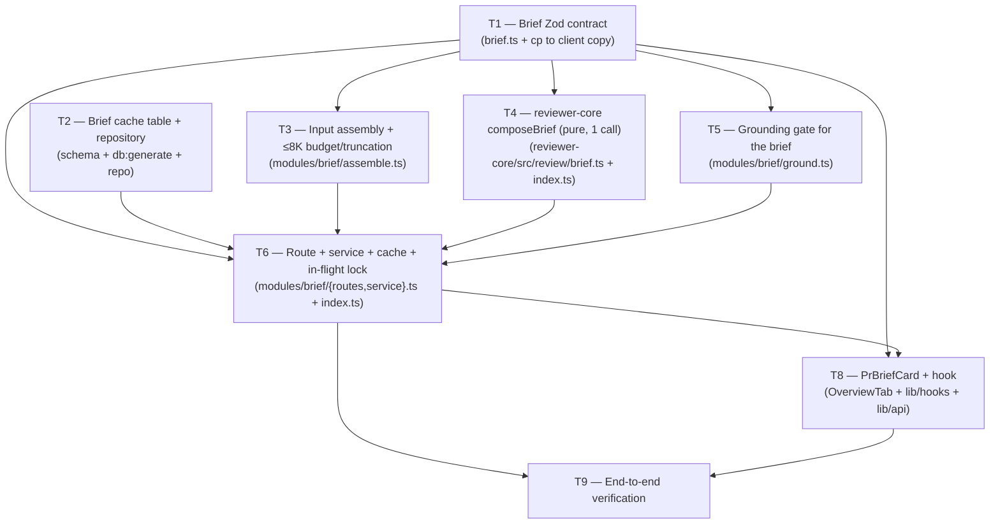

# Plan: Why + Risk Brief  |  Plan ID: PLAN-02  |  Status: draft
Implements: [SPEC-02](../specs/SPEC-02-why-risk-brief.md)

## Goal / Context

Add a compact **Why + Risk Brief** card to the PR page. The design payoff is that it is *nearly
free*: it **assembles artifacts that already exist** — derived `Intent` (L03), `BlastRadius` (L04),
`SmartDiff` per-group stats (L03), the linked issue, and the SPEC-01 Project Context specs — and
spends **exactly one** structured LLM call to compose them into a thin, human-facing
`Brief { what, why, risk_level, risks[], review_focus[] }`. The brief is cached per PR, so reopening
a PR costs **zero** LLM calls; only an explicit **regenerate** spends the call again. Every risk and
every review-focus item is **grounded** mechanically against the assembled blast + smart-diff
evidence (mirroring `groundFindings`), so the card never links to a hallucinated file.

Most of this work is **wiring**, not new engines. The building blocks all exist:

- `BlastService.forPull` (`server/src/modules/blast/service.ts:24-54`) and `SmartDiffService.forPull`
  (`server/src/modules/smart-diff/service.ts:23-46`) already read the deterministic summaries.
- The `resolveEffectiveSet` → `filterContextPaths` → `readFile` Project-Context flow is already
  wired in the executor (`server/src/modules/reviews/run-executor.ts:237-278`) and is reused as-is
  for the spec-text input (AC-2).
- reviewer-core's `extractIntent` (`reviewer-core/src/review/intent.ts:126-162`) is the **exact
  template** for a new pure `composeBrief`: it `assemblePrompt`s untrusted inputs under
  `INJECTION_GUARD`, makes one `completeStructured` call (`reviewer-core/src/llm/openrouter.ts:63`),
  and returns a parsed Zod artifact. The brief compose mirrors it 1:1.
- `groundFindings` (`reviewer-core/src/grounding.ts:52-84`) is the mechanical grounding template:
  keep an item if at least one of its refs is present in the evidence set; drop otherwise. No LLM.
- The `risk_brief` **feature-model registry entry already exists** (`server/src/vendor/shared/
  contracts/platform.ts:17,59-62`, `defaultProvider: 'openai'`) — resolve it with
  `resolveFeatureModel(container, workspaceId, 'risk_brief')` exactly as the intent pass does
  (server INSIGHTS 2026-07-04). **Grep before adding** — the contract/table/registry entry for a
  half-built feature may already exist.
- `container.tokenizer.count` (`server/src/platform/container.ts:139-144`) counts the ≤8K budget.
- The client `BlastRadiusPanel` ref-anchoring pattern `blast?.ref ?? headSha`
  (`client/.../OverviewTab/BlastRadiusPanel.tsx:120-122`) is the template for the focus-link anchor;
  the card mounts in `OverviewTab.tsx:16-31` beside `BlastRadiusPanel`.

The genuinely **new** pieces: (1) the `Brief` Zod contract beside `PrBrief` in `brief.ts`; (2) a
per-PR brief cache table; (3) a `brief` server module that assembles inputs, budgets/truncates,
calls compose once, grounds, caches, and serves; (4) the reviewer-core `composeBrief` pure fn;
(5) the `PrBriefCard` client component + hook. **Exactly one** LLM call per fresh brief; zero on
cache hit.

## Execution mode

**Recommended: multi-agent (parallel), 3 waves — pending user confirmation.** The planner cannot
ask interactively, so this records the recommendation and the exact split.

Rationale: unlike PLAN-01 (a dependency-heavy spine), this feature has a **clean fan-out after a
narrow foundation**. The `Brief` contract (Task 1) + the cache schema (Task 2) are the only shared
gates; once they land, four workstreams touch **disjoint files** and can run in parallel:
reviewer-core compose (Task 4, `reviewer-core/**` only), server assembly+truncation (Task 3,
`modules/brief/assemble.ts`), the grounding gate (Task 5, `modules/brief/ground.ts`), and — after
compose + assembly + ground exist — the route/service/cache wiring (Task 6). The client card
(Task 8) depends only on the contract (Task 1) and the route shape (Task 6). The cross-cutting
risk is that Tasks 3/5/6 all live under `server/src/modules/brief/**`; they are kept parallel by
giving each its **own file** (`assemble.ts`, `ground.ts`, `service.ts`/`routes.ts`) with a single
owner per file — no two parallel tasks write the same file.

**Proposed waves (multi-agent):**

- **Wave 0 (foundation, must land first):** `T1` (Brief contract) ∥ `T2` (cache schema + repo).
  `T1` and `T2` touch disjoint files (`contracts/brief.ts` vs `db/schema/*` + `modules/brief/
  repository.ts`), so they run in parallel.
- **Wave 1 (parallel core, after Wave 0):** `T3` (assemble + budget/truncate) ∥ `T4` (reviewer-core
  `composeBrief`) ∥ `T5` (grounding gate). Fully disjoint files; `T4` is `reviewer-core/**` only.
- **Wave 2 (wiring, after Wave 1):** `T6` (route + service + cache + in-flight lock + outdated/
  source markers) — the integrator, depends on T3/T4/T5. Then `T8` (client card) depends on T1 +
  T6's route; `T7` (server observability wiring for token count / source marker) folds into T6 or
  runs right after. `T9` (verification) last.

**If you prefer single-agent (sequential):** run the numbered order `1 → 2 → 3 → 4 → 5 → 6 → 8 → 9`
(Task 7's observability is absorbed into Task 6). This is a perfectly safe fallback and avoids any
`modules/brief/**` merge contention, at the cost of the parallelism the fan-out offers. Given this
run executes on **Sonnet implementers with a protected context window**, single-agent is the lower-
risk default; multi-agent is the faster path if you want the waves.

## Affected modules

| Module | Stack | Relevant insights (top-3) |
|--------|-------|---------------------------|
| `server/` | Fastify 5 + Drizzle/Postgres | (1) Half-built feature registry entries often pre-exist — the `risk_brief` `FeatureModelId` + `FEATURE_MODELS` row already exist (`platform.ts:17,59`); resolve via `resolveFeatureModel(container, workspaceId, 'risk_brief')` and grep before adding tables/contracts (INSIGHTS 2026-07-04, `run-executor.ts:62-70`). (2) Read-time enrichment composes persisted data with the one LLM call best-effort and OUTSIDE `failAll` — a degraded input must never fail the request (INSIGHTS 2026-07-04/07-05). (3) New enriched fields on repo-returned contracts must be `.nullable().optional()` — the repo layer can't fill them, the service enriches (INSIGHTS 2026-06-20, `trace.ts:94-114`). |
| `reviewer-core/` | pure engine | (1) `extractIntent` is the compose template: one `completeStructured` call, all untrusted inputs `assemblePrompt`-fenced under `INJECTION_GUARD` — injection defense is the **guard, not keyword scanning** (`intent.ts:126-162`, `prompt.ts:16-28`, AGENTS). (2) No side effects beyond `LLMProvider` — file reads / DB / grounding-of-DB happen in the server; the pure fn only takes inputs and returns the parsed `Brief` (AGENTS "Don't add side effects"). (3) Public API is only what `index.ts` re-exports — add `composeBrief` to `index.ts` or the server can't import it (AGENTS, `index.ts:49-56`). |
| `client/` | Next.js 15 + React 19 | (1) Vendored `client/src/vendor/shared/` has **no sync script** — after editing the server `Brief` contract, `cp` it to the client copy in the same task (INSIGHTS 2026-06-20 server-side note; client AGENTS "copy, not source"). (2) All TanStack Query keys go through the `qk` factory or a query and its invalidation drift (INSIGHTS 2026-06-29, `lib/query-keys.ts:13`). (3) Ref-anchor click-to-code with `blast?.ref ?? headSha`, exactly like `BlastRadiusPanel.tsx:120-122`; color must not be the only risk signal (a11y — add a text label). |

## Requirements coverage

| Requirement / AC | Owning task(s) | Status |
|------------------|----------------|--------|
| AC-1  (assemble input only from deterministic artifacts; no raw diff/changed-line text) | Task 3 | covered |
| AC-2  (Project Context specs via `resolveEffectiveSet` → `filterContextPaths`; only `.md` under context folders) | Task 3 | covered |
| AC-3  (any absent artifact omitted; brief still produced from the rest — missing artifact never fails) | Task 3 | covered |
| AC-3b (fully-empty input → **zero** LLM calls + empty "not enough signal yet" brief w/ marker; card empty state) | Task 3, Task 6, Task 8 | covered |
| AC-4  (assembled input ≤ 8,000 tokens by `tokenizer.count` before the call) | Task 3 | covered |
| AC-5  (overflow → fixed-priority truncation, re-measure; never drop intent/blast.summary; never fail) | Task 3 | covered |
| AC-6  (fresh brief → `completeStructured` **exactly once**; zero extra LLM calls) | Task 4, Task 6 | covered |
| AC-7  (compose runs in reviewer-core, **pure** — no DB/GitHub/fs; server passes inputs in) | Task 4 | covered |
| AC-8  (drop any `risks[]` whose every `file_refs` is absent from blast+smart-diff set; survive on ≥1 match) | Task 5 | covered |
| AC-9  (drop any `review_focus[]` whose target file/endpoint absent; target is file + line/symbol, D8) | Task 5, Task 1 | covered |
| AC-10 (surviving caller-file ref → store blast `ref` sha so client anchors to indexed commit) | Task 5, Task 6, Task 8 | covered |
| AC-11 (cached, non-invalidated brief → return cache + **zero** LLM calls) | Task 6 | covered |
| AC-12 (reopen → cache served, no new LLM call; verifiable from call log) | Task 6, Task 8 | covered |
| AC-13 (regenerate → invalidate + **exactly one** fresh call, replacing the cached brief) | Task 6 | covered |
| AC-13b(concurrent regenerate → **single in-flight lock per PR**; overlapping regens cost one call, D7) | Task 6 | covered |
| AC-14 (cache key **per PR** = workspace + PR id; never served cross-PR) | Task 2, Task 6 | covered |
| AC-14b(record built-at head sha; served brief on a newer head marked `outdated`, no auto-call/invalidate, D6) | Task 2, Task 6, Task 8 | covered |
| AC-15 (`risk_level` ∈ existing `RiskSeverity` high\|medium\|low, D2 — no new vocabulary) | Task 1 | covered |
| AC-16 (`PrBriefCard`: risk_level → color; `review_focus[]` links to file at line/symbol, anchored to `ref`\|head) | Task 8 | covered |
| AC-16b(served `outdated` → "outdated — regenerate" badge; empty brief → empty state — not stale/empty as current) | Task 8 | covered |
| AC-17 (record assembled-input token count via `tokenizer.count` so ≤8K is verifiable after the fact) | Task 3, Task 6 | covered |
| AC-18 (record/response distinguishes cache **hit** vs **fresh** — `source: 'cache' \| 'fresh'` marker) | Task 2, Task 6 | covered |

All 20 acceptance criteria (AC-1..AC-18 plus AC-3b/13b/14b/16b) have an owning task. **No coverage
gaps.** The a11y label and the manual "click through to a real file" demo are non-AC design/manual
items per the spec's Non-functional section — carried into Task 8's detail and the Verification note,
not as pass/fail ACs.

## Shared contracts & do-not-touch

- **Shared contracts (read-only for workers unless owned by a task):**
  - **`Brief` Zod contract** (Task 1) — the new thin artifact `{ what, why, risk_level, risks[],
    review_focus[] }` **beside** `PrBrief` in `server/src/vendor/shared/contracts/brief.ts` (source of
    truth). Reuses `RiskSeverity` (`brief.ts:93`) for `risk_level` (D2). Every downstream task
    (compose T4, ground T5, service T6, card T8) reads it; only Task 1 writes it, then `cp`s to the
    client copy. **Do NOT rename** any existing contract — notably not `Intent.intent → summary`
    (the file warns against it, `brief.ts:9-15`); `PrBrief` (`brief.ts:161-168`) is untouched (D1).
  - **Brief cache table shape** (Task 2) — the per-PR cache row (workspace+PR key, `Brief` JSON,
    built-at head sha, source marker, input token count). Every wiring/read path (T6) depends on it.
  - **`composeBrief` reviewer-core export** (Task 4) — added to `reviewer-core/src/index.ts` so the
    server can import it; the server (T6) consumes it read-only.
  - **`resolveEffectiveSet` / `filterContextPaths`** (`run-executor.ts:237-248`) — **reused as-is**,
    not changed. No SPEC-01 code is edited.
- **Do-not-touch:**
  - `server/src/db/migrations/**` — generated. Edit `db/schema/`, then `pnpm db:generate` (Task 2).
    Never hand-edit a migration.
  - `client/src/vendor/shared/**` — vendored copy, **no sync script**. Edit the server source of
    truth, then `cp` to the client copy in the same task (Task 1 only).
  - Lockfiles (`pnpm-lock.yaml` server/client; `package-lock.json` reviewer-core). server/client =
    **pnpm**; reviewer-core = **npm** — do not mix.
  - Existing deterministic contracts `Intent` / `BlastRadius` / `Risk` / `SmartDiff` / `PrBrief`
    (`brief.ts`) — **not** renamed or restructured (D1). `Brief` is additive only.
  - reviewer-core stays **pure**: no DB/GitHub/fs in `composeBrief` — the server assembles + grounds
    against DB-derived evidence and passes only plain inputs in (AC-7).

## Task graph

Wave grouping (multi-agent): **Wave 0** `{T1}` ∥ `{T2}` → **Wave 1** `{T3}` ∥ `{T4}` ∥ `{T5}` →
**Wave 2** `{T6}` → `{T8}` → `{T9}`. Every file under `server/src/modules/brief/**` has a single
owning task (T3=`assemble.ts`, T5=`ground.ts`, T6=`routes.ts`+`service.ts`), so no two parallel
tasks write the same file. (Observability — token count + source marker — is Task 7 below, folded
into T6; kept as a distinct row only to name its ACs.)

## Tasks

| # | Title | Owner path(s) | Domain | Skills | Depends-on | Parallel? | Success check |
|---|-------|---------------|--------|--------|------------|-----------|---------------|
| 1 | Brief Zod contract | `server/src/vendor/shared/contracts/brief.ts` (append), `client/src/vendor/shared/contracts/brief.ts` (cp only) | Shared contracts | zod, typescript-expert, security | — | Wave 0 (∥ T2) | `pnpm typecheck` (server) + client copy byte-identical |
| 2 | Brief cache table + repository | `server/src/db/schema/context.ts` (or new `brief.ts` schema), `server/src/modules/brief/repository.ts` (new) | DB schema / backend | onion-architecture, drizzle-orm-patterns, postgresql-table-design, zod, typescript-expert, security | — | Wave 0 (∥ T1) | `pnpm db:generate` clean + `.it.test` round-trip |
| 3 | Input assembly + ≤8K budget/truncation | `server/src/modules/brief/assemble.ts` (new, pure) | Backend | onion-architecture, security, zod, typescript-expert | 1 | Wave 1 (∥ T4, T5) | `pnpm exec vitest run` (unit) |
| 4 | reviewer-core `composeBrief` (pure, one call) | `reviewer-core/src/review/brief.ts` (new), `reviewer-core/src/index.ts` (export) | Pure engine | zod, typescript-expert, security (pure-engine conventions) | 1 | Wave 1 (∥ T3, T5) | `npm test` + `npm run typecheck` (reviewer-core) |
| 5 | Grounding gate for the brief | `server/src/modules/brief/ground.ts` (new, pure) | Backend | onion-architecture, security, zod, typescript-expert | 1 | Wave 1 (∥ T3, T4) | `pnpm exec vitest run` (unit) |
| 6 | Route + service + cache + in-flight lock + observability | `server/src/modules/brief/{routes,service}.ts` (new), `server/src/modules/index.ts` (register) | Backend | onion-architecture, fastify-best-practices, drizzle-orm-patterns, zod, typescript-expert, security | 1, 2, 3, 4, 5 | Wave 2 | `pnpm exec vitest run .it.test` |
| 7 | Observability (token count + `source` marker) | — (folded into Task 6's files) | Backend | (see Task 6) | 2, 3 | with 6 | AC-17/AC-18 asserted in Task 6's `.it.test` |
| 8 | PrBriefCard + hook | `client/.../pulls/[number]/_components/OverviewTab/PrBriefCard.tsx` (new) + `OverviewTab.tsx`, `client/src/lib/hooks/*.ts`, `client/src/lib/api.ts` | UI | frontend-architecture, react-best-practices, next-best-practices, zod, typescript-expert, security (+ react-testing-library) | 1, 6 | after 6 | `pnpm test` + `pnpm build` (client) |
| 9 | End-to-end verification | — (read-only run of suites) | Verification | (n/a — command runner) | 6, 8 | last | all per-module suites green |

Every code file has a **single owner**. Under `server/src/modules/brief/**`, T3 owns `assemble.ts`,
T5 owns `ground.ts`, T6 owns `routes.ts`+`service.ts`+`repository.ts` consumption; only T6 edits
`modules/index.ts`. So Wave 1's three tasks never collide.

## Task detail

### Task 1 — Brief Zod contract
- **Intent:** Add the new thin `Brief` artifact **beside** `PrBrief`, the source-of-truth every
  downstream task reads (AC-15, AC-9's file+line target shape, D1, D2, D8). One owned place so no
  other task edits contracts.
- **Files:**
  - `server/src/vendor/shared/contracts/brief.ts` — **append** (do not restructure the file):
    - `ReviewFocus` = `{ file: z.string(), line: z.number().int().nullish(), symbol: z.string().nullish(),
      reason: z.string() }` — a **file + line/symbol** location so the card can deep-link (D8, AC-9,
      AC-16). At least one of line/symbol carried through for the anchor.
    - `BriefRisk` — reuse `Risk`'s `file_refs` idea for grounding; either reuse `Risk`
      (`brief.ts:96-103`) directly or a thinner `{ title, explanation, severity: RiskSeverity,
      file_refs: z.array(z.string()) }`. `file_refs` is what the grounding gate (T5) matches on (AC-8).
    - `BriefSource` = `z.enum(['fresh', 'cache'])` (AC-18) and a neutral/marker for the empty
      "not enough signal yet" brief (AC-3b) — e.g. `materialized: z.boolean()` or reuse a source
      value; the implementer picks one and documents it (see Recommendations).
    - `Brief` = `{ what: z.string(), why: z.string(), risk_level: RiskSeverity, risks: z.array(BriefRisk),
      review_focus: z.array(ReviewFocus) }` — **`risk_level` REUSES `RiskSeverity`** (`brief.ts:93`),
      no new vocabulary (D2, AC-15). Lives beside `PrBrief` (`brief.ts:161-168`), does **not** replace
      it (D1).
    - The response/record wrapper carrying `ref` sha (AC-10), `built_head_sha`, `outdated` (AC-14b),
      `source` (AC-18), and `input_tokens` (AC-17) — either on `Brief` or a `BriefResponse` envelope.
      Make repo-unfillable enriched fields `.nullable().optional()` (server INSIGHTS 2026-06-20).
  - `client/src/vendor/shared/contracts/brief.ts` — **`cp` the edited server file** (no sync script;
    server INSIGHTS 2026-06-20 / client AGENTS). This is the only allowed touch of the vendored copy.
- **Skills to apply:** zod, typescript-expert, security (from `skill-routing`: *Shared contracts*
  `server/src/vendor/shared/**` → zod + typescript-expert; untrusted-field awareness = security).
- **Insights to honor:** Do **not** rename `Intent.intent` or any existing contract (`brief.ts:9-15`,
  D1). Enriched fields the repo can't fill are `.nullable().optional()` (INSIGHTS 2026-06-20). `cp`
  the client copy in this same task.
- **Wrap-up:** `capturing-insights` — note the empty-brief marker choice if non-obvious.
- **Acceptance test:** `pnpm typecheck` (server) green; client copy byte-identical to the server file.

### Task 2 — Brief cache table + repository
- **Intent:** A per-PR brief cache: key by workspace + PR id (AC-14), store the `Brief` JSON, the
  **built-at head sha** (AC-14b), the **source** marker (AC-18), and the **input token count**
  (AC-17). The storage contract Task 6 reads/writes.
- **Files:**
  - `server/src/db/schema/context.ts` (or a new `server/src/db/schema/brief.ts` registered in the
    schema barrel) — a `pr_brief_cache` table: `workspace_id`, `pr_id` (unique together = per-PR key,
    AC-14), `brief jsonb $type<Brief>()`, `built_head_sha text`, `input_tokens integer`,
    `source text`, timestamps. Model the `jsonb $type<...>()` column on existing precedents (e.g.
    `skills.evidenceFiles jsonb $type<string[]>()`). **`grep` first** — the `risk_brief` feature is
    half-built; confirm no `pr_brief`/`brief` table/repo already exists before adding
    (server INSIGHTS 2026-07-04, `run-executor.ts:62-70`).
  - `pnpm db:generate` to produce the migration — **never hand-edit `server/src/db/migrations/**`**
    (global do-not-touch).
  - `server/src/modules/brief/repository.ts` (new) — `getByPull(workspaceId, prId)`,
    `upsert(workspaceId, prId, brief, builtHeadSha, inputTokens, source)`, `invalidate(...)`.
    Filter every read by `workspace_id` (tenant safety, server INSIGHTS 2026-06-29 pattern).
- **Skills to apply:** onion-architecture, drizzle-orm-patterns, postgresql-table-design, zod,
  typescript-expert, security (from `skill-routing`: *DB schema* adds drizzle-orm-patterns +
  postgresql-table-design on top of *Backend*).
- **Insights to honor:** Migrations are generated — edit schema then `db:generate`, never hand-edit
  (do-not-touch). Grep for a pre-existing brief table before adding (INSIGHTS 2026-07-04). Enriched
  fields `.nullable().optional()` on any repo-returned contract (INSIGHTS 2026-06-20).
- **Wrap-up:** `capturing-insights`.
- **Acceptance test:** `pnpm db:generate` produces a clean migration; a `.it.test` round-trips
  upsert → getByPull (per-PR key isolation: a brief for PR-A never returned for PR-B, AC-14) →
  invalidate → miss. `pnpm exec vitest run .it.test`.

### Task 3 — Input assembly + ≤8K budget/truncation (pure)
- **Intent:** The deterministic input builder. Assemble the LLM input **only** from the existing
  deterministic artifacts and enforce the ≤8K budget with fixed-priority truncation — no raw diff,
  no LLM (AC-1, AC-2, AC-3, AC-3b, AC-4, AC-5, AC-17).
- **Files:**
  - `server/src/modules/brief/assemble.ts` (new, **pure/unit-testable**, following the "pure core +
    thin service" shape — mirror `smart-diff/compose.ts`, server INSIGHTS 2026-07-05):
    - Input: the already-read artifacts — `Intent` (from the pr_intent read), `BlastRadius`
      (`summary`, `changed_symbols`, `downstream` callers, `endpoints_affected`, `crons_affected`,
      `prior_prs`, `ref` — the shape `BlastService.forPull` returns, `blast/service.ts:24-54`),
      `SmartDiff` per-group stats (path + role + additions/deletions/finding_lines,
      `smart-diff/service.ts:23-46`), the linked issue text, and the resolved Project Context spec
      texts. **Never** raw diff / changed-line bodies (AC-1). The *service* (T6) does the reads and
      passes them in; this fn is a pure transform.
    - **Project Context resolution (AC-2):** resolve via the SPEC-01 mechanism —
      `resolveEffectiveSet` → `filterContextPaths` → `git.readFile`
      (`run-executor.ts:237-278`). Reuse it; do not reimplement. (The read happens in T6/service;
      this pure fn receives the already-read spec texts.)
    - **Untrusted framing:** produce the input as blocks the compose fn (T4) will render through
      `assemblePrompt`'s untrusted slots — intent text, issue body, spec texts are attacker-
      influenceable (spec Untrusted-inputs). This fn only structures them; the fencing is T4's
      `wrapUntrusted` under `INJECTION_GUARD`. **(cross-model #1)** Keep each untrusted input as a
      **discrete field** — never concatenate untrusted text into a single trusted string here, or
      T4's per-field fencing can be defeated. The pure fn hands T4 separable untrusted values, not a
      pre-merged blob.
    - **Budget (AC-4/AC-17):** expose the assembled input to `container.tokenizer.count`
      (`container.ts:139-144`); T6 measures and records the count. Design the assembled object so it
      can be measured before the call.
    - **Truncation (AC-5, D3):** on overflow, drop in fixed order, re-measuring after each drop:
      (1) Project Context spec texts → (2) `prior_prs` → (3) `downstream` callers beyond top-N by
      caller count → (4) `SmartDiff` `boilerplate`-group file rows. **Never** drop `intent` text or
      `blast.summary`. Deterministic: identical PR state → identical assembled input.
    - **Final clamp (cross-model #3):** if the input is **still > 8K after all fixed-order drops**
      (e.g. a huge `intent` text or `blast.summary`, which are never dropped), apply a last-resort
      **character-budget truncation** to those never-dropped fields (truncate + ellipsis marker) so
      the ≤8K invariant (AC-4) **always** holds and the request still never fails. This is the only
      place protected fields may be shortened, and only to keep AC-4 true; unit-test it.
    - **Empty detection (AC-3/AC-3b):** each artifact optional; omit absent sections (AC-3). Expose a
      predicate for **fully-empty** (no intent, blast `degraded`/`no_data`, no smart-diff finding
      overlay, no linked issue) so T6 can short-circuit to the empty brief with **zero** LLM calls
      (AC-3b, D5).
- **Skills to apply:** onion-architecture, security, zod, typescript-expert (from `skill-routing`:
  *Backend*; **security** load-bearing — the assembly handles untrusted text).
- **Insights to honor:** Reuse the SPEC-01 resolver (`run-executor.ts:237-248`), don't reimplement.
  Never embed raw diff bodies (AC-1). Deterministic truncation. Do **not** add keyword/denylist
  scanning — the guard is the defence (reviewer-core AGENTS).
- **Wrap-up:** `capturing-insights`.
- **Acceptance test:** unit tests: (a) input never contains raw diff/changed-line text (AC-1);
  (b) an over-8K input truncates in the fixed order and never drops intent/blast.summary, and the
  re-measured result is ≤8K (AC-5); (c) a fully-empty input set trips the empty predicate (AC-3b);
  (d) an absent single artifact is omitted, others survive (AC-3). `pnpm exec vitest run`.

### Task 4 — reviewer-core `composeBrief` (pure, exactly one call)
- **Intent:** The single structured LLM call. A **pure** reviewer-core fn (no DB/GitHub/fs) that
  takes the assembled inputs, fences the untrusted ones, makes **exactly one** `completeStructured`
  call, and returns the parsed `Brief` (AC-6, AC-7). Mirrors `extractIntent` 1:1.
- **Files:**
  - `reviewer-core/src/review/brief.ts` (new) — modelled on `intent.ts:126-162`:
    - Input interface `{ llm, model, ...assembled inputs..., sessionId?, language?, maxRetries?,
      onEvent? }` (mirror `ExtractIntentInput`, `intent.ts:76-103`).
    - Build a **trusted** `BRIEF_SYSTEM` prompt (task statement only; `assemblePrompt` appends
      `INJECTION_GUARD`, mirror `INTENT_SYSTEM`, `intent.ts:48-74`). It states the output fields
      (what/why/risk_level/risks/review_focus) but **not** the JSON shape — the schema enforces it.
    - Route the untrusted inputs — derived intent text, linked issue body, Project Context spec
      texts, and the (repo-derived but still wrapped) blast/smart-diff summaries — through
      `assemblePrompt` so each is `wrapUntrusted`-fenced under `INJECTION_GUARD` (spec Untrusted-
      inputs; `prompt.ts:16-44,133-136,153`). The blast/smart-diff summaries go in the `specs`/
      dedicated untrusted slots. **No untrusted text in the trusted system prompt.**
    - One `input.llm.completeStructured<Brief>({ schema: Brief, schemaName: 'Brief', messages, ... })`
      (`openrouter.ts:63`). **Exactly one call** — no grounding/citation/translation call here (AC-6).
      Return `{ brief, tokensIn, tokensOut, costUsd, raw }` (mirror `ExtractIntentResult`).
  - `reviewer-core/src/index.ts` — **export `composeBrief`** + its types (add beside the `extractIntent`
    export at `index.ts:49-56`), or the server can't import it (AGENTS "public API is index.ts").
- **Skills to apply:** zod, typescript-expert, security + the pure-engine conventions (from
  `skill-routing`: `reviewer-core/**` → the engine conventions; **security** = untrusted wrapping).
- **Insights to honor:** No side effects beyond `LLMProvider` — no DB/fs/grounding-of-DB here; the
  server assembles + grounds and passes plain inputs in (AGENTS, AC-7). Injection defense is
  `INJECTION_GUARD`, **not** keyword scanning (AGENTS). Export via `index.ts` (AGENTS).
- **Wrap-up:** `capturing-insights`.
- **Acceptance test:** hermetic test with a `MockLLMProvider` returning a fixture `Brief`: assert
  (a) exactly one `completeStructured` call (AC-6); (b) untrusted inputs appear only inside
  `<untrusted>` fences, never in the system message (spec Untrusted-inputs); (c) the parsed `Brief`
  is returned. `npm test` + `npm run typecheck` (reviewer-core, **npm** not pnpm).

### Task 5 — Grounding gate for the brief (pure)
- **Intent:** The mechanical grounding gate — drop any risk / focus item whose target is absent from
  the assembled blast + smart-diff evidence, before caching/returning. **No LLM** (AC-8, AC-9, AC-10).
  Mirrors `groundFindings`.
- **Files:**
  - `server/src/modules/brief/ground.ts` (new, **pure/unit-testable**) — model on
    `groundFindings` (`reviewer-core/src/grounding.ts:52-84`):
    - Build the **evidence set** = files/endpoints present in the assembled inputs: blast
      `changed_symbols[].file`, `downstream[].callers[].file`, `downstream[].endpoints_affected`,
      `crons_affected`, and smart-diff `groups[].files[].path`. (This is a server-side gate against
      DB-derived evidence, so it lives in the server, **not** reviewer-core — AC-7 keeps the engine
      pure.)
    - **Risks (AC-8):** keep a `risks[]` entry if **at least one** of its `file_refs` is in the
      evidence set; drop if all are absent (mirrors `docs/grounding-gate.md:13-14` — survive on one
      match). A brief with all risks dropped is still valid (empty `risks[]`).
    - **Focus (AC-9):** keep a `review_focus[]` entry if its **file/endpoint** is in the evidence
      set; drop otherwise. The `line`/`symbol` (D8) is carried through unchanged for the anchor —
      grounding matches on file/endpoint presence, not the exact line.
    - **Ref carry (AC-10):** for a surviving item mapping to a **caller file**, carry the blast `ref`
      sha so the client anchors to the indexed commit (the service/T6 stores `ref` on the record;
      this fn flags which survivors are caller-file refs vs changed files). Mirror the
      `blast?.ref ?? headSha` intent.
- **Skills to apply:** onion-architecture, security, zod, typescript-expert (from `skill-routing`:
  *Backend*; **security** — grounding is the anti-hallucination gate).
- **Insights to honor:** Grounding is **mechanical, not LLM-checked** — no second call
  (spec Non-goals, `docs/grounding-gate.md:24-30`). Match "at least one ref present" like the
  findings gate. Keep it pure/unit-testable.
- **Wrap-up:** `capturing-insights`.
- **Acceptance test:** unit tests: (a) a risk whose every `file_ref` is absent is dropped; a risk
  with one present ref survives (AC-8); (b) a focus item outside the evidence is dropped, one inside
  survives with its line/symbol intact (AC-9); (c) all-risks-dropped yields a valid empty-`risks`
  brief. `pnpm exec vitest run`.

### Task 6 — Route + service + cache + in-flight lock + observability (integrator)
- **Intent:** Wire it together: `POST /pulls/:id/brief` → cache check → (fresh path: read artifacts,
  assemble (T3), compose once (T4), ground (T5), cache, serve) with the per-PR **in-flight lock**,
  the **regenerate** invalidation, the **outdated** head-sha marker, and the **source**/token-count
  observability (AC-6, AC-10, AC-11, AC-12, AC-13, AC-13b, AC-14, AC-14b, AC-17, AC-18, AC-3b).
- **Files:**
  - `server/src/modules/brief/service.ts` (new) — the orchestrator:
    - **Cache check (AC-11/AC-12):** `briefRepo.getByPull(workspaceId, prId)`; on hit return it with
      `source: 'cache'` and **zero** LLM calls. Compare the PR's current head sha to the stored
      `built_head_sha`; if different, mark the response **`outdated`** — **no** auto-invalidate, **no**
      LLM call (AC-14b, D6). Unchanged head → served with no badge, no call (AC-12).
    - **Regenerate (AC-13):** an explicit regenerate flag/param invalidates the cache and forces the
      fresh path — exactly one new call, replacing the cached brief.
    - **In-flight lock (AC-13b, D7):** a **single in-flight promise per PR** (keyed by workspace+PR)
      — a second regenerate while one is in flight **awaits the same promise**, costing **one** call.
      Use an in-memory `Map<key, Promise<Brief>>` cleared on settle (in-process is sufficient for the
      studio single-node model; note the assumption).
    - **Fresh path:** read `Intent` (pr_intent), `BlastRadius` (`BlastService.forPull`,
      `blast/service.ts:24`), `SmartDiff` (`SmartDiffService.forPull`, `smart-diff/service.ts:23`),
      the linked issue, and the Project Context spec texts (via the SPEC-01 resolver,
      `run-executor.ts:237-278`) → `assemble` (T3). **Best-effort per artifact, OUTSIDE any failAll**
      — a degraded input omits its section, never fails (server INSIGHTS 2026-07-04/07-05, AC-3).
    - **Empty short-circuit (AC-3b):** if T3's empty predicate trips, **skip the LLM call** and
      return the empty "not enough signal yet" brief (empty risks/focus, neutral `risk_level`, the
      empty marker). Zero calls.
    - **Budget (AC-4/AC-17):** measure the assembled input with `container.tokenizer.count`
      (`container.ts:139-144`); store the count on the record (AC-17). T3 already guarantees ≤8K.
    - **Compose (AC-6):** resolve the model via `resolveFeatureModel(container, workspaceId,
      'risk_brief')` — the entry already exists (`platform.ts:17,59`) — then `container.llm(provider)`
      → `composeBrief` (T4). Exactly one call.
    - **Ground (AC-8/9/10):** `ground` (T5) the returned `Brief` against the assembled evidence
      before caching; store the blast `ref` on the record for caller-file anchors (AC-10).
    - **Cache + source (AC-18):** `briefRepo.upsert(..., builtHeadSha, inputTokens, source: 'fresh')`;
      the response carries `source` so cache-hit vs fresh is verifiable without provider logs.
  - `server/src/modules/brief/routes.ts` (new) — schema-first via `fastify-type-provider-zod` using
    the Task 1 contracts (server AGENTS "routes are schema-first"). No hand-rolled `Schema.parse`.
  - `server/src/modules/index.ts` — register the `brief` module (one import + one entry, mirror
    `blast`/`smartDiff` at `index.ts:10-14,29-43`).
- **Skills to apply:** onion-architecture, fastify-best-practices, drizzle-orm-patterns, zod,
  typescript-expert, security (from `skill-routing`: *Backend* + *routes* + *DB access* + untrusted).
- **Insights to honor:** Resolve `risk_brief` via `resolveFeatureModel`; the registry entry already
  exists — don't add a new one (INSIGHTS 2026-07-04, `platform.ts:59`). Keep the whole assemble→
  compose→ground block best-effort and OUTSIDE `failAll` (INSIGHTS 2026-07-04/07-05). Routes
  schema-first (server AGENTS). Tenant-filter every cache read by `workspace_id` (INSIGHTS 2026-06-29).
- **Wrap-up:** `capturing-insights`.
- **Acceptance test:** `.it.test` proving: (a) first call is `source:'fresh'` + one LLM call
  (mocked provider) + token count recorded (AC-6/17/18); (b) second call for the same PR is
  `source:'cache'` + **zero** LLM calls (AC-11/12); (c) regenerate → one fresh call replacing the
  cache (AC-13); (d) two concurrent regenerates → **one** LLM call (AC-13b); (e) a stored brief on a
  changed head sha is served `outdated` with no call (AC-14b); (f) a fully-empty PR returns the empty
  brief with **zero** calls (AC-3b); (g) a per-PR key never leaks across PRs (AC-14). `pnpm exec
  vitest run .it.test`.

### Task 7 — Observability (token count + `source` marker)
- **Intent:** Make the ≤8K budget (AC-4) and the cache-hit-vs-fresh distinction (AC-18) provable
  after the fact — record the assembled-input token count (AC-17) and the `source` marker (AC-18).
- **Files:** none of its own — **folded into Task 6's** `service.ts` + the Task 1 contract fields +
  the Task 2 columns. Listed as a distinct row only to name AC-17/AC-18 ownership explicitly.
- **Skills to apply:** as Task 6.
- **Insights to honor:** as Task 6 (the token count uses `container.tokenizer.count`,
  `container.ts:139-144`).
- **Acceptance test:** asserted inside Task 6's `.it.test` (token count present on a fresh brief;
  `source` distinguishes `fresh` vs `cache`).

### Task 8 — PrBriefCard + hook
- **Intent:** The PR-page card: risk level by **color + text label** (a11y), `review_focus[]` items
  as deep links to file at line/symbol anchored to `ref`/head, plus the **outdated** badge and the
  empty state (AC-16, AC-16b, AC-3b, AC-10, AC-12).
- **Files:**
  - `client/.../pulls/[number]/_components/OverviewTab/PrBriefCard.tsx` (new) + mount it in
    `OverviewTab.tsx:16-31` beside `BlastRadiusPanel` (pass `prId`, `repoFullName`, `headSha` as
    `OverviewTab` already threads them, `OverviewTab.tsx:9-14`).
    - Map `risk_level` → a distinct color per high/medium/low **and** a textual label — color is not
      the only signal (spec a11y). Keyboard-navigable focus links.
    - `review_focus[]` items → links to the file at its **line/symbol** (D8), anchored with
      `brief.ref ?? headSha` — the **exact** pattern in `BlastRadiusPanel.tsx:120-122`
      (`const linkSha = blast?.ref ?? headSha`). Reuse the repo file-URL helper (`lib/github-urls`).
    - **Outdated (AC-14b/16b):** when the served brief is `outdated`, render an
      "outdated — regenerate" badge (a regenerate action hits the T6 route with the regenerate flag),
      not a stale brief presented as current.
    - **Empty (AC-3b/16b):** when the brief is the empty "not enough signal yet" marker, render the
      empty state, not a blank/low-risk brief.
  - `client/src/lib/hooks/*.ts` (new hook, e.g. `useBrief` mirroring `useBlastRadius` in
    `client/src/lib/hooks/reviews.ts`) — TanStack Query over the T6 route; keys via the **`qk`
    factory** (client INSIGHTS 2026-06-29, `lib/query-keys.ts:13`); a regenerate mutation invalidates
    the brief key via `qk` so reopen serves cache with no refetch driving a call (AC-12).
  - `client/src/lib/api.ts` — typed `POST /pulls/:id/brief` call consuming the Task 1 `Brief` contract.
- **Skills to apply:** frontend-architecture, react-best-practices, next-best-practices, zod,
  typescript-expert, security + react-testing-library (from `skill-routing`).
- **Insights to honor:** `qk` factory for keys + invalidation (INSIGHTS 2026-06-29). Ref-anchor with
  `blast?.ref ?? headSha` exactly like `BlastRadiusPanel.tsx:120-122`. Color is not the only risk
  signal — add a text label (a11y). Verify typecheck exit explicitly:
  `pnpm typecheck; echo "EXIT=$?"` (client INSIGHTS 2026-06-29); tests need the intl provider with
  the right namespace.
- **Wrap-up:** `capturing-insights`.
- **Acceptance test:** component tests (mocked fetch): (a) each risk_level renders its color **and**
  a text label (AC-16 + a11y); (b) a focus item renders a link to file+line anchored to `ref` when
  present, else head (AC-16); (c) an `outdated` brief shows the badge (AC-16b); (d) the empty brief
  shows the empty state (AC-3b/16b). `pnpm test` + `pnpm build`.

### Task 9 — End-to-end verification
- **Intent:** Prove the whole change works together across modules (see Verification below).
- **Files:** none (runs the suites read-only).
- **Skills to apply:** n/a (command runner).
- **Acceptance test:** all per-module suites green (see Verification).

## Recommendations

- *proposed* — **Model the empty "not enough signal yet" brief with an explicit boolean marker**
  (e.g. `materialized: boolean` on the record) rather than overloading `source`. `source` answers
  "cache vs fresh" (AC-18); "materialized vs empty-signal" is a separate axis (AC-3b). Two orthogonal
  flags keep the card's branching unambiguous. Left to the implementer; flagged so the choice is
  deliberate.
- *proposed* — **Reuse `Risk` (`brief.ts:96-103`) for `BriefRisk` rather than a new shape** if its
  `file_refs`/`severity` fit — it already carries `severity: RiskSeverity` and `file_refs: string[]`,
  which are exactly what the grounding gate (T5) and the color map (T8) need. A thinner bespoke type
  is fine too; the spec fixes only the field set, not the type identity (D1/D2).
- *proposed* — **Keep the in-flight lock in-process (a `Map<key, Promise>`).** The studio is a
  single-node host (AGENTS "API and web run on the host"); a cross-process lock (advisory DB lock)
  is over-engineering for D7's single-node guarantee. Note the single-node assumption in a comment so
  a future multi-node deployment revisits it.
- *proposed* — **Given Sonnet implementers + a protected context window, scope tests to the highest-
  value ACs first:** the T6 `.it.test` (single-call, cache-hit-zero-call, regenerate, in-flight lock,
  outdated, empty — the feature's whole contract) and the T3/T5 pure unit tests (truncation +
  grounding) are the load-bearing ones. The T4 reviewer-core "one call + fencing" test and the T8
  card-state tests are next. Everything is *specified* above; if a test task must be trimmed, trim
  the T8 render assertions last-and-least, never the T6 single-call/cache proof.
- *proposed* — **Single-agent sequential is the safer default for this run** (Sonnet + context
  budget), despite the multi-agent fan-out being available; see Execution mode. The user owns this
  choice.

## Verification (end-to-end)

Run per module after the owning tasks land:

- **`reviewer-core/`** (npm) — `npm run typecheck` + `npm test`: the new `composeBrief` makes exactly
  one structured call and fences all untrusted inputs; no regression to `assemblePrompt`/`groundFindings`.
- **`server/`** (pnpm) — `pnpm typecheck`; `pnpm exec vitest run --exclude '**/*.it.test.ts'`
  (hermetic: assemble truncation/empty-detection T3, grounding gate T5); then `pnpm db:migrate` and
  `pnpm exec vitest run .it.test` (Docker: cache round-trip + per-PR isolation T2, and the T6
  integrator suite — single-call, cache-hit-zero-call, regenerate, in-flight lock, outdated, empty,
  token count, source marker). Covers AC-1..AC-18 mechanics.
- **`client/`** (pnpm) — `pnpm test` (PrBriefCard: color+label, focus links anchored to ref/head,
  outdated badge, empty state — mocked fetch) then `pnpm build`. Verify typecheck exit explicitly:
  `pnpm typecheck; echo "EXIT=$?"` (client INSIGHTS 2026-06-29).
- **Manual demo (not an automated AC, per spec Non-functional):** generate a brief on a real PR and
  confirm each surviving risk / focus item links to a **real** file that opens at the right place,
  and that a hallucinated ref would be dropped. LLM-dependent — human-verified, not a pass/fail AC.
