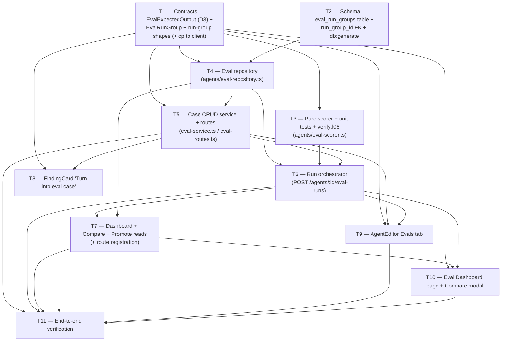

# Plan: Eval Pipeline  |  Plan ID: PLAN-03  |  Status: draft
Implements: [SPEC-03](../specs/SPEC-03-eval-pipeline.md)

## Goal / Context

Wire the **scaffolded-but-empty** eval foundation into a working regression-testing loop: turn an
accepted/dismissed finding into a fixed eval case (one click), run an agent's *current* prompt
version over its frozen case set, score `recall` / `precision` / `citation_accuracy` in **pure,
zero-LLM code**, and surface run history + Compare (metric deltas + system-prompt diff) + Promote,
plus a cross-agent Eval Dashboard. Two runs of two prompt versions over the same frozen inputs
become directly comparable numbers.

The design is mostly **wiring on top of existing pieces** — the spec's own inventory is confirmed
in-repo:

- Tables `eval_cases` / `eval_runs` already exist (`server/src/db/schema/eval.ts:7-35`) with every
  metric column (`recall`, `precision`, `citationAccuracy`, `actualOutput`, `pass`, `durationMs`,
  `costUsd`). The **only** additive schema change is the D1 `eval_run_groups` table + a nullable
  `run_group_id` FK on `eval_runs`.
- Contracts already exist: `EvalCase` / `EvalRun` / `EvalOwnerKind` (`knowledge.ts:58-84`),
  `EvalCaseInput` / `EvalRunRecord` / `EvalRunResult` / `EvalTrendPoint` / `EvalDashboard`
  (`eval-ci.ts:20-89`), and the `Finding` shape the expectations are built on
  (`findings.ts:47-63`). The **new** contract work is a run-group record + the discriminated
  `expectedOutput` shape (D3).
- The scorer's one reused primitive — `groundFindings` — is exported at
  `reviewer-core/src/index.ts:23` and is a pure diff-parse (`reviewer-core/src/grounding.ts:52-84`)
  with the exact file+line-range-intersection rule AC-8 requires (`grounding.ts:41-46`).
- The agent-review call per case reuses `reviewPullRequest`
  (`reviewer-core`, wired at `run-executor.ts:323`); the stored `input_diff` **text** is turned
  into a `UnifiedDiff` with the existing `parseUnifiedDiff` (`server/src/adapters/git/diff-parser.ts`,
  used by `reviews/diff-loader.ts:2-3,43`) — no re-fetch from the live PR (AC-6).
- Prompt versioning reuses `agents.version` + `agent_versions` + `AgentVersion`
  (`agents.ts:33,38-49`, `knowledge.ts:287-293`) for Compare/Promote — no parallel scheme.
- The `verify:l06` gate mirrors the existing `verify:l03` convention (`server/package.json:12`).

The genuinely **new** pieces: (1) the run-group table + FK + Ring-1 run-group/expectedOutput Zod
shapes; (2) a **pure** eval scorer service (D6, Ring 2) that reuses `groundFindings`; (3) Fastify
routes (case CRUD + `POST /agents/:id/eval-runs` + run-group/dashboard reads) with a run
orchestrator that replays frozen inputs through the review pipeline; (4) client: FindingCard
"Turn into eval case", an AgentEditor **Evals** tab, an **Eval Dashboard** page, and a **Compare**
modal.

## Execution mode

**Recommended: multi-agent (parallel), 4 waves — PENDING the user's explicit go-ahead.** The parent
**will pause before dispatching any implementer**; this section only records the recommendation and
the exact split. The planner cannot ask interactively.

Rationale: the change has the natural onion layering the request calls out — a narrow Ring-1
foundation (contracts + schema) gates a **clean fan-out**. Once the run-group table + the
`expectedOutput`/run-group Zod shapes land, three backend workstreams touch **disjoint files** and
run in parallel: the **pure scorer** (`modules/agents/eval-scorer.ts`, no routes, no DB), the
**repository** (`modules/agents/eval-repository.ts` + reads/writes), and — after those — the
**routes + run orchestrator**. The client's four surfaces depend only on the contracts (Wave 0) and
the route shapes (Wave 2), and split across disjoint component folders.

The cross-cutting risk is that several backend files live under `server/src/modules/agents/**`;
they are kept parallel by giving **each task its own new file** (`eval-scorer.ts`,
`eval-repository.ts`, `eval-routes.ts`, `eval-service.ts`) with a single owner per file — no two
parallel tasks write the same file. The only shared existing file any task edits is
`modules/agents/routes.ts` (T7 only) and `modules/index.ts` is untouched (agents is already
registered).

**Proposed waves (multi-agent):**

- **Wave 0 (foundation, must land first):** `T1` (run-group + `expectedOutput` Zod contracts + cp)
  ∥ `T2` (schema: `eval_run_groups` table + `run_group_id` FK + `db:generate`). `T1` touches
  `vendor/shared/contracts/*`; `T2` touches `db/schema/eval.ts` — disjoint, so parallel.
- **Wave 1 (parallel core, after Wave 0):** `T3` (pure scorer + unit tests + `verify:l06`,
  `eval-scorer.ts`) ∥ `T4` (eval repository, `eval-repository.ts`). Fully disjoint files; `T3` is
  contracts-only-dependent, `T4` depends on the T2 schema.
- **Wave 2 (backend wiring, after Wave 1):** `T5` (case CRUD service+routes) then `T6` (run
  orchestrator: `POST /agents/:id/eval-runs`) then `T7` (dashboard/compare/promote reads +
  route registration). T5→T6→T7 share `eval-service.ts`/`eval-routes.ts` conceptually; keep them
  **sequential within the wave** (they are the same owner lane) OR split into separate files with a
  single owner each and run T5 ∥ T7-reads while T6 waits on T4. Default: sequential T5→T6→T7.
- **Wave 3 (client, after Wave 2):** `T8` (FindingCard "Turn into eval case") ∥ `T9` (AgentEditor
  Evals tab) ∥ `T10` (Eval Dashboard page + Compare modal). Disjoint component folders; all depend
  on T1 contracts + the T5/T6/T7 routes. `T11` (verification) last.

**If you prefer single-agent (sequential):** run the numbered order `1 → 2 → 3 → 4 → 5 → 6 → 7 → 8
→ 9 → 10 → 11`. This is the lower-risk default on Sonnet implementers with a protected context
window, and it avoids any `modules/agents/**` contention; multi-agent is the faster path if you
want the waves. **The user owns this choice** — nothing is dispatched until the go-ahead.

## Affected modules

| Module | Stack | Relevant insights (top-3) |
|--------|-------|---------------------------|
| `server/` | Fastify 5 + Drizzle/Postgres | (1) **Half-built eval foundation was DEAD until wired** — tables/contracts/repo methods often pre-exist; grep before adding, and keep any enrichment/best-effort pass OUTSIDE `failAll` (INSIGHTS 2026-07-04, `run-executor.ts:62-70,123-128`). (2) **Pure-core + thin-DB-service split** is the house pattern for read/compose features — put the scorer in a hermetically testable `eval-scorer.ts` (no `Container`), DB I/O in the repo (INSIGHTS 2026-07-05, `smart-diff/compose.ts`). (3) **`db/schema.ts` barrel needs BOTH the named import AND the `schema` object entry** or `db:generate` silently skips the table; enriched repo-returned fields are `.nullable().optional()` (INSIGHTS 2026-07-10 / 2026-06-20). Tenant-scope every eval read by `workspace_id` (INSIGHTS 2026-06-29). |
| `reviewer-core/` | pure engine | (1) `groundFindings` is exported and pure (`index.ts:23`, `grounding.ts:52-84`) — **reuse it, do not add a new scorer here** (D6: the scorer is a *server* Ring-2 fn; reviewer-core stays the review engine). (2) The agent-under-test review call reuses `reviewPullRequest` (`index.ts:38-47`) exactly as `run-executor.ts:323` invokes it — no new engine surface. (3) No side effects beyond `LLMProvider`; the scorer takes plain `(expected, emitted, diff)` — reviewer-core needs **no edits** for this plan (read-only import surface). |
| `client/` | Next.js 15 + React 19 | (1) Vendored `client/src/vendor/shared/` has **no sync script** — after editing a server contract, propagate with Bash `cp -f` in the same task; `Write`/`Edit` to that path are denied (INSIGHTS 2026-06-20 / 2026-07-10). (2) All TanStack Query keys go through the `qk` factory or a query/invalidation drift (INSIGHTS 2026-06-29, `lib/query-keys.ts:13`); dynamic-segment client pages use `useParams()`, never `params` props (INSIGHTS 2026-07-10). (3) Metric up/down + pass/fail must **not** be color-only (spec a11y); `SectionLabel icon=` only accepts registered `IconName`s (INSIGHTS 2026-07-11, `vendor/ui/icons.tsx`). |

## Requirements coverage

| Requirement / AC | Owning task(s) | Status |
|------------------|----------------|--------|
| AC-1  (accepted finding → `must_find` case: ownerKind='agent', ownerId, inputDiff, expectedOutput) | T5, T8 | covered |
| AC-2  (dismissed finding → `must_not_flag` case: forbidden file+range) | T5, T8 | covered |
| AC-3  (both expectation types over `Finding` shape inside `expectedOutput` jsonb, discriminated by `type`, both scorable) | T1, T3 | covered |
| AC-4  (case creation is one click; `type` derived from accept/dismiss state, no extra input) | T8, T5 | covered |
| AC-5  (agent case set holds ≥8 cases, workspace-scoped, listed in Evals tab) | T4, T7, T9 | covered |
| AC-6  (run uses stored inputDiff/inputFiles/inputMeta verbatim; no re-fetch of live PR) | T6 | covered |
| AC-7  (run records the agent's current prompt version, `agents.version`) | T4, T6 | covered |
| AC-8  (match iff same file AND `[start..end]` intersects — grounding gate's rule) | T3 | covered |
| AC-9  (recall = matched/total must_find; zero-expected → recall = 1) | T3 | covered |
| AC-10 (precision = non-FP / emitted; must_not_flag hit = FP; zero-emitted → precision = 1) | T3 | covered |
| AC-11 (scorer makes ZERO LLM calls; `verify:l06` asserts it via throwing provider stub) | T3 | covered |
| AC-12 (citation_accuracy = fraction of emitted surviving `groundFindings` vs inputDiff; zero-emitted → 1) | T3 | covered |
| AC-13 (persist one `eval_runs` row per case with metrics + duration + costUsd, associated to run group) | T4, T6 | covered |
| AC-14 (identical (expected, emitted, diff) scored twice → byte-identical metrics; deterministic) | T3 | covered |
| AC-15 (run history newest-first w/ aggregates, prompt version, total cost → EvalTrendPoint/EvalRunRecord/EvalDashboard) | T4, T7 | covered |
| AC-16 (Compare two runs → per-metric delta + system_prompt diff between the two recorded versions) | T7, T10 | covered |
| AC-17 (prompt change → same fixed set before/after → metrics independently computed per run) | T6, T3 | covered (demoable; direction is manual, not an AC) |
| AC-18 (Promote → set active config to chosen run's version via existing agent-version mechanism) | T7, T10 | covered |
| AC-19 (`verify:l06` = `tsc --noEmit && vitest run <scorer pattern>`; green; asserts AC-14 + AC-11 + D1 migration applies) | T3 | covered |
| AC-20 (Eval Dashboard lists every agent w/ current metrics + recent runs + "Run all agents") | T7, T10, T6 | covered |

**All 20 acceptance criteria (AC-1..AC-20) have an owning task. No coverage gaps.** Non-AC design
items carried into task detail, not as pass/fail ACs: the a11y label/keyboard-nav (spec
Non-functional → T9/T10), the graceful "version unavailable" degrade on a pruned version (edge case
→ T7/T10), the malformed-`expectedOutput`-fails-the-case-not-the-run stance (edge case → T3/T6),
and the concurrent-Run-all distinct-group behaviour (edge case → T6). **One environment risk** is
flagged in Recommendations, not a coverage gap: the left-sidebar nav entry for the Dashboard page
lives in vendored `@devdigest/ui` `NAV` (do-not-touch) — see Risks.

## Shared contracts & do-not-touch

- **Shared contracts (read-only for workers unless owned by a task):**
  - **Run-group + `expectedOutput` Zod shapes** (T1) — the new Ring-1 pieces, **appended** to
    `server/src/vendor/shared/contracts/` (source of truth), then `cp`-propagated to the client copy:
    - An **`EvalExpectedOutput`** discriminated union (D3): `must_find` = `{ type: 'must_find',
      findings: Finding[] }` (non-empty expected set) vs `must_not_flag` = `{ type: 'must_not_flag',
      findings: [] (empty), forbidden: { file, start_line, end_line }[] }`. Reuses `Finding`
      (`findings.ts:47-63`). This is what T3's scorer discriminates on and what T5/T8 write.
    - An **`EvalRunGroup`** record contract mirroring the D1 table (id, workspace_id, owner_kind,
      owner_id, agent_version, label, ran_at, aggregate recall/precision/citation_accuracy,
      total_cost_usd) + the run-group-aware run request/response shapes (e.g. an
      `EvalRunGroupResult` wrapping `EvalRunResult[]` + the group aggregate). Extend the existing
      `EvalRunRecord` with a nullable `run_group_id` if the dashboard needs it; do **not** rename any
      existing eval contract field.
    - Every downstream task reads these; only T1 writes them, then `cp`s the edited file(s) (incl.
      the barrel `index.ts` if a new contract file is added) to `client/src/vendor/shared/`.
  - **D1 schema** (T2) — the `eval_run_groups` table + nullable `run_group_id` FK on `eval_runs` in
    `server/src/db/schema/eval.ts`; **additive only** — nothing in `eval_cases`/`eval_runs` renamed
    or dropped. T4/T6 depend on it.
  - **`groundFindings`** (`reviewer-core/src/index.ts:23`) — **reused as-is**, not changed. No
    reviewer-core edits in this plan.
  - **`reviewPullRequest`** (`reviewer-core/src/index.ts:38-47`) + **`parseUnifiedDiff`**
    (`server/src/adapters/git/diff-parser.ts`) — reused as-is by the T6 orchestrator.
  - **`agents.version` / `agent_versions` / `AgentVersion`** (`agents.ts:33,38-49`,
    `knowledge.ts:287-293`) + the agents service's version-bump path (`agents/service.ts:102-121,252`)
    — reused by T7 for Compare's prompt diff (AC-16) and Promote (AC-18). No parallel versioning.
- **Do-not-touch:**
  - `server/src/db/migrations/**` — generated. Edit `db/schema/eval.ts`, then `pnpm db:generate`
    (T2). **Never hand-edit a migration.** Update BOTH the barrel named import AND the `schema`
    object entry or the table is silently skipped (INSIGHTS 2026-07-10).
  - `client/src/vendor/shared/**` — vendored copy, no sync script. `Write`/`Edit` are **denied**;
    propagate the server source of truth with Bash `cp -f` in the same task (T1 only) (INSIGHTS
    2026-07-10).
  - `client/src/vendor/ui/**` (incl. `@devdigest/ui` `NAV`) — vendored, treated as third-party.
    The Dashboard page can be created and reached by URL/route; adding a sidebar `NAV` entry is
    out-of-surface for the implementers — see Risks/Recommendations.
  - Lockfiles: `pnpm-lock.yaml` (server/client) vs `package-lock.json` (reviewer-core). server/client
    = **pnpm**; reviewer-core = **npm** — never mix.
  - `reviewer-core/**` — no edits needed; import `groundFindings`/`reviewPullRequest` read-only. The
    scorer must **not** be added here (D6).

## Task graph

Wave grouping (multi-agent): **Wave 0** `{T1}` ∥ `{T2}` → **Wave 1** `{T3}` ∥ `{T4}` → **Wave 2**
`{T5}` → `{T6}` → `{T7}` (sequential, same backend lane) → **Wave 3** `{T8}` ∥ `{T9}` ∥ `{T10}` →
`{T11}`. Every new backend file has one owning task; the only shared existing file edited is
`modules/agents/routes.ts` (T7, register the eval sub-routes) — kept to a single owner.

## Tasks

| # | Title | Owner path(s) | Domain | Skills | Depends-on | Parallel? | Success check |
|---|-------|---------------|--------|--------|------------|-----------|---------------|
| 1 | Run-group + `expectedOutput` contracts | `server/src/vendor/shared/contracts/{eval-ci,knowledge}.ts` (append), client copy (cp only) | Shared contracts | zod, typescript-expert, security | — | Wave 0 (∥ T2) | `pnpm typecheck` (server) + client copy byte-identical |
| 2 | Schema: `eval_run_groups` + FK | `server/src/db/schema/eval.ts`, `server/src/db/schema.ts` (barrel) | DB schema | onion-architecture, drizzle-orm-patterns, postgresql-table-design, zod, typescript-expert, security | — | Wave 0 (∥ T1) | `pnpm db:generate` clean migration |
| 3 | Pure scorer + tests + `verify:l06` | `server/src/modules/agents/eval-scorer.ts` (new), `server/src/modules/agents/eval-scorer.test.ts` (new), `server/package.json` (add script) | Backend + tests | onion-architecture, typescript-expert, security, zod, backend-testing | 1 | Wave 1 (∥ T4) | `pnpm verify:l06` green |
| 4 | Eval repository | `server/src/modules/agents/eval-repository.ts` (new) | DB access | onion-architecture, drizzle-orm-patterns, postgresql-table-design, zod, typescript-expert, security | 1, 2 | Wave 1 (∥ T3) | `.it.test` round-trip (case CRUD + run-group + per-case rows) |
| 5 | Case CRUD service + routes | `server/src/modules/agents/eval-service.ts` (new), `server/src/modules/agents/eval-routes.ts` (new) | Backend | onion-architecture, fastify-best-practices, typescript-expert, security, zod | 1, 4 | Wave 2 | `.it.test` (create must_find/must_not_flag, list ≥8, workspace isolation) |
| 6 | Run orchestrator (`POST /agents/:id/eval-runs`) | `server/src/modules/agents/eval-service.ts` (extend, single owner), `eval-runner.ts` (new, optional) | Backend | onion-architecture, fastify-best-practices, typescript-expert, security, zod | 3, 4, 5 | Wave 2 (after T5) | `.it.test` (frozen inputs replayed, run group + per-case rows, distinct groups) |
| 7 | Dashboard + Compare + Promote reads + route reg | `server/src/modules/agents/eval-service.ts` (extend), `eval-routes.ts` (extend), `server/src/modules/agents/routes.ts` (register sub-routes) | Backend | onion-architecture, fastify-best-practices, typescript-expert, security, zod | 4, 6 | Wave 2 (after T6) | `.it.test` (dashboard aggregate, compare delta+prompt-diff, promote sets version) |
| 8 | FindingCard "Turn into eval case" | `client/src/app/repos/[repoId]/pulls/[number]/_components/findings/FindingCard/FindingCard.tsx`, colocated `.test.tsx`, `client/src/lib/hooks/*.ts`, `client/src/lib/api.ts` | UI | frontend-architecture, react-best-practices, next-best-practices, typescript-expert, security, zod, react-testing-library | 1, 5 | Wave 3 | `pnpm test` + `pnpm build` (client) |
| 9 | AgentEditor **Evals** tab | `client/src/app/agents/[id]/_components/AgentEditor/_components/EvalsTab/**` (new), `AgentEditor.tsx` + `constants.ts` (register tab), hooks/api | UI | frontend-architecture, react-best-practices, next-best-practices, typescript-expert, security, zod, react-testing-library | 1, 5, 6 | Wave 3 | `pnpm test` + `pnpm build` (client) |
| 10 | Eval Dashboard page + Compare modal | `client/src/app/evals/page.tsx` (new) + `_components/**`, hooks/api | UI | frontend-architecture, react-best-practices, next-best-practices, typescript-expert, security, zod, react-testing-library | 1, 6, 7 | Wave 3 | `pnpm test` + `pnpm build` (client) |
| 11 | End-to-end verification | — (read-only run of suites) | Verification | (n/a — command runner) | 5, 6, 7, 8, 9, 10 | last | all per-module suites green |

Every new code file has a **single owner**. Under `server/src/modules/agents/**`: T3 owns
`eval-scorer.ts`(+test), T4 owns `eval-repository.ts`, T5 creates `eval-service.ts`+`eval-routes.ts`
and T6/T7 **extend** those two files — so T5→T6→T7 run **sequentially** (same owner lane), never in
parallel with each other. T7 is the only task editing existing `routes.ts`.

## Task detail

### Task 1 — Run-group + `expectedOutput` contracts (Ring 1)
- **Intent:** Add the two new Zod shapes every downstream task depends on: the D3 discriminated
  `expectedOutput` union (so `must_find`/`must_not_flag` are both scorable by one scorer, AC-3) and
  the `EvalRunGroup` record + run-group-aware request/response shapes (AC-13/AC-15). Source of truth
  is the server contracts; propagate to the client copy in this same task.
- **Files:**
  - `server/src/vendor/shared/contracts/eval-ci.ts` — **append** (do not restructure):
    - `EvalExpectedOutput` = a Zod **discriminated union on `type`** (D3): `z.object({ type:
      z.literal('must_find'), findings: z.array(Finding).min(1) })` and `z.object({ type:
      z.literal('must_not_flag'), findings: z.array(Finding).length(0), forbidden:
      z.array(z.object({ file: z.string(), start_line: z.number().int(), end_line: z.number().int()
      })).min(1) })`. Reuse `Finding` from `findings.ts:47-63` (already imported here at
      `eval-ci.ts:2`). This is the shape stored in the `expectedOutput` jsonb — **no schema change**
      (D3).
    - `EvalRunGroup` = `{ id, workspace_id, owner_kind: EvalOwnerKind, owner_id, agent_version:
      z.number().int(), label: z.string().nullish(), ran_at: z.string(), recall/precision/
      citation_accuracy: z.number(), total_cost_usd: z.number().nullable() }` — mirrors the D1 table.
    - An `EvalRunGroupResult` (run-all response) = `{ group: EvalRunGroup, results:
      z.array(EvalRunResult) }` reusing existing `EvalRunResult` (`eval-ci.ts:49-54`). Extend
      `EvalRunRecord` (`eval-ci.ts:33-46`) with `run_group_id: z.string().nullish()` (nullable — the
      column is nullable; per INSIGHTS 2026-06-20 keep enriched/repo-unfillable fields `.nullish()`).
    - Do **not** rename any existing eval contract field (the `EvalDashboard`/`EvalTrendPoint`
      aggregates at `eval-ci.ts:57-89` already fit — populate, don't restructure).
  - `client/src/vendor/shared/contracts/eval-ci.ts` — **`cp -f` the edited server file** (Bash, not
    `Write`/`Edit` — those are denied; INSIGHTS 2026-07-10). If a new contract *file* were added, also
    `cp` the barrel `index.ts`; here we only extend an existing file, so cp that one file.
- **Skills to apply:** zod, typescript-expert, security (from `skill-routing`: *Shared contracts*
  `server/src/vendor/shared/**` → zod + typescript-expert; untrusted-field awareness = security —
  the `expectedOutput` carries PR-derived text consumed only by deterministic code).
- **Insights to honor:** No sync script — `cp -f` the client copy in the same task (INSIGHTS
  2026-06-20 / 2026-07-10). Enriched/nullable-FK fields `.nullish()` (INSIGHTS 2026-06-20). Grep for
  a pre-existing run-group shape before adding (half-built foundation, INSIGHTS 2026-07-04).
- **Wrap-up:** `capturing-insights` — note the `EvalExpectedOutput` discriminator choice if non-obvious.
- **Acceptance test:** `pnpm typecheck` (server) green; client copy byte-identical to the server file.

### Task 2 — Schema: `eval_run_groups` + `run_group_id` FK (D1)
- **Intent:** The one additive schema change: a run-group row the per-case `eval_runs` rows point to
  (AC-13), keeping aggregates first-class. Nothing existing renamed/dropped.
- **Files:**
  - `server/src/db/schema/eval.ts` — **append** an `evalRunGroups` `pgTable`: `id uuid pk
    defaultRandom`, `workspaceId → workspaces.id (cascade)` (mirror `evalCases.workspaceId:9-11`),
    `ownerKind text enum ['skill','agent']`, `ownerId uuid`, `agentVersion integer`, `label text
    nullable`, `ranAt timestamptz defaultNow notNull`, aggregate `recall`/`precision`/
    `citationAccuracy` `doublePrecision` (mirror `evalRuns:30-32`), `totalCostUsd doublePrecision
    nullable`. Then add a **nullable** `runGroupId uuid('run_group_id').references(() =>
    evalRunGroups.id, { onDelete: 'set null' })` column to `evalRuns` (`eval.ts:22-35`) — nullable so
    existing rows and old-path runs are unaffected.
  - `server/src/db/schema.ts` (barrel) — add BOTH the named import AND the `schema` object entry for
    `evalRunGroups`, or `db:generate` silently skips the table (INSIGHTS 2026-07-10, `agents.ts:43`
    note).
  - `pnpm db:generate` → produces the migration under `server/src/db/migrations/**`. **Never
    hand-edit** the generated migration (global do-not-touch).
- **Skills to apply:** onion-architecture, drizzle-orm-patterns, postgresql-table-design, zod,
  typescript-expert, security (from `skill-routing`: *DB schema* adds drizzle-orm-patterns +
  postgresql-table-design on top of *Backend*).
- **Insights to honor:** Barrel needs both import + `schema` entry (INSIGHTS 2026-07-10). Migrations
  are generated — edit schema then `db:generate`, never hand-edit (do-not-touch). FK nullable so the
  change is purely additive (D1).
- **Wrap-up:** `capturing-insights`.
- **Acceptance test:** `pnpm db:generate` produces a clean, additive migration (a new `CREATE TABLE
  eval_run_groups` + an `ALTER TABLE eval_runs ADD COLUMN run_group_id`); `pnpm typecheck` green.
  (The migration-applies assertion is folded into T3's `verify:l06` per D5.)

### Task 3 — Pure eval scorer + unit tests + `verify:l06` (Ring 2, D6)
- **Intent:** The heart of the spec: a **pure function** `scoreCase(expected, emitted, diff)` (and a
  `scoreRun(cases[])` aggregator) computing match / recall / precision / citation_accuracy with
  **zero LLM calls** (AC-8..AC-12, AC-14), reusing `groundFindings`. Lives in a server service (D6),
  **not** reviewer-core. Hermetically unit-testable (no `Container`, mirror `smart-diff/compose.ts`,
  INSIGHTS 2026-07-05).
- **Files:**
  - `server/src/modules/agents/eval-scorer.ts` (new, **pure**):
    - Import `groundFindings` from `@devdigest/reviewer-core` (`index.ts:23`) and the `Finding` /
      `EvalExpectedOutput` (T1) types. Takes `(expected: EvalExpectedOutput, emitted: Finding[],
      diff: UnifiedDiff)`; returns `{ pass, recall, precision, citation_accuracy }` plus enough for
      the per-case `eval_runs` row.
    - **Match rule (AC-8):** an expected finding is matched iff some emitted finding has the **same
      `file`** AND `[start_line..end_line]` **intersects** the expected range (inclusive). This is
      the exact rule `groundFindings` uses (`grounding.ts:41-46` `rangeIntersects`); factor a small
      local `rangeIntersects` OR reuse the semantics — do not invent a different rule.
    - **recall (AC-9):** `must_find` → matched / total expected; **zero expected → recall = 1**
      (vacuous), never `0/0`.
    - **precision (AC-10):** emitted non-false-positives / total emitted; a `must_not_flag` case's
      `forbidden` target being intersected by an emitted finding counts as a **false positive**;
      **zero emitted → precision = 1**.
    - **citation_accuracy (AC-12):** fraction of `emitted` that survive `groundFindings(emitted,
      diff)` (`.kept.length / emitted.length`); **zero emitted → 1**. Reuse the gate, do not
      reimplement a citation check.
    - **Determinism (AC-14):** pure function of `(expected, emitted, diff)` — no `Date.now`, no
      random, no map-ordering dependence; identical inputs → byte-identical metrics.
    - **Malformed `expectedOutput` (edge case):** if `EvalExpectedOutput.safeParse` fails, the
      **case** is marked failed/skipped and surfaced — it must **not** throw and fail a whole run
      (mirrors SPEC-01's never-fail-the-batch stance; the run-loop in T6 catches per-case).
  - `server/src/modules/agents/eval-scorer.test.ts` (new, hermetic — `skill-routing` *Backend tests*
    adds **backend-testing**): assert (a) intersection matching incl. partial overlap `[10..14]`
    matches `[12..12]`, and same-file-required (AC-8); (b) recall/precision/citation on populated and
    on zero-denominator inputs (AC-9/10/12 vacuous rules); (c) **byte-identical** metrics when the
    same inputs are scored twice (AC-14); (d) **zero-LLM**: run the scorer with a **throwing
    `LLMProvider` stub** in scope and assert it is **never invoked** (AC-11) — the scorer takes no
    provider, so the assertion is that no provider is constructed/called on the scoring path.
  - `server/package.json` — add `"verify:l06": "tsc --noEmit -p tsconfig.json && vitest run
    eval-scorer"` (mirror `verify:l03:12`). Per D5 the gate also asserts the D1 migration applies —
    include a scorer-adjacent test (or an `.it.test` guarded by Docker) that runs the migration and
    asserts `eval_run_groups` exists; if Docker-gated tests can't be in the default `verify:l06`
    pattern, keep the migration-applies check in the T4 `.it.test` and document that `verify:l06`
    covers determinism + zero-LLM while `pnpm db:migrate` proves the migration (note the split
    explicitly).
- **Skills to apply:** onion-architecture (purity / Ring-2 placement — D6), typescript-expert,
  security, zod, backend-testing (from `skill-routing`: *Backend* + *Backend tests*).
- **Insights to honor:** Pure-core split — no `Container`, unit-test with plain arrays (INSIGHTS
  2026-07-05). Scorer is server Ring-2, **not** reviewer-core (D6). Reuse `groundFindings`, don't
  reimplement grounding.
- **Wrap-up:** `capturing-insights`.
- **Acceptance test:** `pnpm verify:l06` green (typecheck + scorer tests; determinism + zero-LLM
  proven).

### Task 4 — Eval repository (Ring 3)
- **Intent:** All eval DB I/O behind a repository: case CRUD, run-group insert + per-case
  `eval_runs` insert, and the dashboard/history reads — the DB half of the pure/service split.
- **Files:**
  - `server/src/modules/agents/eval-repository.ts` (new) — methods (all **workspace-scoped**):
    - `createCase(workspaceId, input: EvalCaseInput)` / `listCases(workspaceId, ownerKind, ownerId)`
      (must support ≥8, AC-5) / `getCase` / `deleteCase`. Filter every read by `workspace_id`
      (`evalCases.workspaceId:9-11`; INSIGHTS 2026-06-29 tenant safety).
    - `createRunGroup(workspaceId, { ownerKind, ownerId, agentVersion, label, aggregates,
      totalCostUsd })` → returns the group id; `insertRunRow(runGroupId, caseId, { actualOutput,
      pass, recall, precision, citationAccuracy, durationMs, costUsd })` (AC-13) — associate every
      per-case `eval_runs` row with its group via `run_group_id` (T2 FK).
    - `listRunGroups(workspaceId, ownerId)` newest-first (AC-15), `getRunGroup(id)`,
      `runRowsForGroup(id)` (for Compare, AC-16), `dashboardAggregate(workspaceId)` across all agents
      (AC-20). Populate the existing `EvalRunRecord`/`EvalTrendPoint`/`EvalDashboard` contracts
      (`eval-ci.ts:33-89`) — enriched/derived fields `.nullish()` on the returned shapes (INSIGHTS
      2026-06-20).
    - Record the agent's **current version** on the group at creation time (AC-7) — read
      `agents.version` (`agents.ts:33`); the actual read may live in the service and be passed in.
  - A colocated `eval-repository.it.test.ts` (Docker `.it.test`) round-tripping case CRUD +
    run-group + per-case rows, and asserting per-PR/per-workspace isolation.
- **Skills to apply:** onion-architecture, drizzle-orm-patterns, postgresql-table-design, zod,
  typescript-expert, security, backend-testing (from `skill-routing`: *DB access* / repository
  adapters → drizzle + postgresql-table-design; the `.it.test` adds backend-testing).
- **Insights to honor:** Tenant-scope every read by `workspace_id` (INSIGHTS 2026-06-29). Repo returns
  contract-typed rows; enriched fields `.nullish()` (INSIGHTS 2026-06-20). Grep for a pre-existing
  eval repository before adding (half-built foundation, INSIGHTS 2026-07-04).
- **Wrap-up:** `capturing-insights`.
- **Acceptance test:** `pnpm exec vitest run .it.test` — create ≥8 cases and list them (AC-5);
  run-group + per-case rows persisted and re-read with aggregates (AC-13); a case/group for one
  workspace never returned for another (tenant isolation).

### Task 5 — Case CRUD service + routes
- **Intent:** The case-management API: create a case from a finding (both expectation types, AC-1/2/4),
  list an agent's cases (AC-5). Thin service over T4; schema-first routes over T1 contracts.
- **Files:**
  - `server/src/modules/agents/eval-service.ts` (new — the eval service, owned by T5, extended by
    T6/T7): `createCaseFromFinding(workspaceId, agentId, finding, action)` — derive the
    `expectedOutput` **from the accept/dismiss state, not a user prompt** (AC-4): `accept` →
    `{ type: 'must_find', findings: [finding] }` (AC-1); `dismiss` → `{ type: 'must_not_flag',
    findings: [], forbidden: [{ file, start_line, end_line }] }` (AC-2). Persist `inputDiff` = the
    finding's diff fragment, `ownerKind='agent'`, `ownerId=agentId`. Plus `createCase` (manual "New
    eval case" modal, free-form expected) and `listCases`.
  - `server/src/modules/agents/eval-routes.ts` (new — owned by T5, extended by T6/T7): schema-first
    via `fastify-type-provider-zod` (server AGENTS "routes are schema-first"; mirror the existing
    `agents/routes.ts` structure). `POST /agents/:id/eval-cases`, `GET /agents/:id/eval-cases`,
    `DELETE /agents/:id/eval-cases/:caseId` — validate the body against `EvalCaseInput`/the T1
    expectation shape; workspace via `getContext` (`agents/routes.ts:81`).
  - (Route registration into `agents/routes.ts` or `modules/index.ts` is **T7's** single-owner edit —
    T5 exports the route plugin/handlers; T7 registers.)
- **Skills to apply:** onion-architecture, fastify-best-practices, typescript-expert, security, zod
  (from `skill-routing`: *Backend* + routes are schema-first).
- **Insights to honor:** Routes schema-first, no hand-rolled `Schema.parse` (server AGENTS). Derive
  the case `type` from accept/dismiss, don't ask (AC-4). Tenant-scope via `getContext`
  (`agents/routes.ts:81`). The `expectedOutput` text is untrusted but consumed only by deterministic
  code — no keyword scanning (spec Untrusted-inputs).
- **Wrap-up:** `capturing-insights`.
- **Acceptance test:** `.it.test` — accepted finding → a `must_find` case with the finding's
  file+range (AC-1); dismissed → `must_not_flag` with the forbidden target (AC-2); list returns ≥8
  cases (AC-5); another workspace's agent can't create/list against this one.

### Task 6 — Run orchestrator (`POST /agents/:id/eval-runs`)
- **Intent:** Run an agent over its **frozen** case set, score each case (T3), persist a run group +
  per-case rows (T4). Frozen inputs replayed verbatim — no live-PR re-fetch (AC-6); current prompt
  version recorded (AC-7); the review call is the one-per-case LLM cost, scoring adds zero
  (AC-11/13/17).
- **Files:**
  - `server/src/modules/agents/eval-service.ts` (**extend**, single owner via sequential T5→T6):
    `runAgentEvals(workspaceId, agentId, label?)`:
    - Load the agent (for `provider`/`model`/`system_prompt`/`version`) and its case set (T4).
    - For each case: turn the stored `inputDiff` **text** into a `UnifiedDiff` with
      `parseUnifiedDiff` (`server/src/adapters/git/diff-parser.ts`, as `reviews/diff-loader.ts:2-3,43`
      does) — **verbatim from storage, never re-derived from the live PR** (AC-6). Run the agent via
      `reviewPullRequest` (`reviewer-core`, exactly as `run-executor.ts:323` invokes it) with
      `container.llm(agent.provider)` — this is the one review LLM call per case (the thing under
      test). Time it (`durationMs`), capture `costUsd`.
    - **Score with T3's pure `scoreCase`** — zero additional LLM calls (AC-11). Persist one
      `eval_runs` row per case with `actualOutput` + metrics via T4 `insertRunRow`, associated to a
      run group created at the **start** of the run (AC-13); the group records the agent's **current
      version** (AC-7) + aggregate metrics + total cost.
    - **Per-case failure isolation (edge case):** a malformed `expectedOutput` or a review error
      **fails that case row**, never the whole run (mirror the never-fail-the-batch stance; wrap each
      case in try/catch → skip + surface).
    - **Concurrency (edge case):** each `runAgentEvals` invocation creates its **own** run group id at
      start, so two overlapping "Run all" for one agent never interleave rows (D1 default: allow
      concurrent, distinct groups).
    - **`Run all agents` (AC-20):** a `runAllAgents(workspaceId)` that runs each enabled agent over
      its own frozen set (bounded cost = agents × cases review calls; scoring free).
  - `server/src/modules/agents/eval-routes.ts` (**extend**): `POST /agents/:id/eval-runs` →
    `runAgentEvals`, returning `EvalRunGroupResult` (T1). `POST /eval-runs` (or
    `/agents/eval-runs:all`) → `runAllAgents`.
- **Skills to apply:** onion-architecture, fastify-best-practices, typescript-expert, security, zod
  (from `skill-routing`: *Backend* + routes).
- **Insights to honor:** Replay stored inputs verbatim; `parseUnifiedDiff` is the existing text→diff
  path (`diff-loader.ts:43`). Reuse `reviewPullRequest` as `run-executor.ts:323` does — don't build a
  new engine call. Keep per-case scoring OUTSIDE any batch-fail (best-effort per case; INSIGHTS
  2026-07-04 failAll stance). One review call per case; scoring zero (AC-11).
- **Wrap-up:** `capturing-insights`.
- **Acceptance test:** `.it.test` with a **MockLLMProvider** returning fixture findings: (a) a run
  replays each case's stored `inputDiff` (no live-PR fetch) and records the agent's version (AC-6/7);
  (b) a run group + one `eval_runs` row per case are persisted with metrics + cost (AC-13); (c) the
  scoring path makes **zero** provider calls beyond the per-case review (AC-11 — count calls =
  number of cases); (d) two overlapping runs write distinct groups (edge case); (e) a case with a
  malformed `expectedOutput` fails only that row (edge case). `pnpm exec vitest run .it.test`.

### Task 7 — Dashboard + Compare + Promote reads + route registration
- **Intent:** The read/aggregate + version surfaces: run history (AC-15), Compare's per-metric delta
  + `system_prompt` diff between two runs' versions (AC-16), Promote (AC-18), and the cross-agent
  dashboard (AC-20). Registers the eval sub-routes.
- **Files:**
  - `server/src/modules/agents/eval-service.ts` (**extend**): `runHistory(workspaceId, agentId)` →
    newest-first groups with aggregates + version + cost, populating `EvalTrendPoint[]` /
    `EvalRunRecord[]` / `EvalDashboard` (`eval-ci.ts:57-89`, AC-15). `compare(workspaceId, agentId,
    runGroupIdA, runGroupIdB)` → per-metric `delta` (`EvalDashboard.delta:80-84`) **plus** the
    `system_prompt` diff resolved from each group's recorded `agentVersion` via the existing
    `agent_versions` / `AgentVersion.config` (`agents/service.ts:getVersion`, `agents.ts:38-49`,
    `knowledge.ts:287-293`) — **degrade gracefully to "version unavailable"** if a version was pruned
    (edge case, AC-16). `promote(workspaceId, agentId, version)` → set the agent's active config to
    that recorded version via the **existing agent-version mechanism** (the agents service's
    update/version path, `agents/service.ts:102-121,252`) — **no divergent versioning scheme**
    (AC-18). `dashboard(workspaceId)` across all agents (AC-20).
  - `server/src/modules/agents/eval-routes.ts` (**extend**): `GET /agents/:id/eval-runs` (history),
    `POST /agents/:id/eval-compare` (or `GET` with two ids), `POST /agents/:id/promote/:version`,
    `GET /evals/dashboard`.
  - `server/src/modules/agents/routes.ts` (**register** the eval route plugin — the single edit to an
    existing file; mirror how `agents/routes.ts` is a self-contained plugin, or register a nested
    `app.register(evalRoutes)`).
- **Skills to apply:** onion-architecture, fastify-best-practices, typescript-expert, security, zod
  (from `skill-routing`: *Backend* + routes).
- **Insights to honor:** Reuse `agents.version` + `agent_versions` for the prompt diff and Promote —
  no parallel scheme (D2, spec Open-Q 2). Degrade to "version unavailable" on a pruned version (edge
  case). Populate — don't restructure — the existing dashboard aggregate contracts. Tenant-scope
  every read (INSIGHTS 2026-06-29).
- **Wrap-up:** `capturing-insights`.
- **Acceptance test:** `.it.test`: (a) history returns groups newest-first with aggregates + version
  + cost (AC-15); (b) compare returns per-metric deltas + a `system_prompt` diff between two versions,
  and "version unavailable" when a version is pruned (AC-16); (c) promote sets the agent's active
  config to the chosen version via the agent-version path (AC-18); (d) dashboard lists every agent
  with current metrics (AC-20). `pnpm exec vitest run .it.test`.

### Task 8 — FindingCard "Turn into eval case" (client)
- **Intent:** The one-click case-creation action (AC-1/2/4): an **accepted** finding → `must_find`,
  a **dismissed** finding → `must_not_flag`; the `type` is derived from the finding's action state,
  no further input.
- **Files:**
  - `client/src/app/repos/[repoId]/pulls/[number]/_components/findings/FindingCard/FindingCard.tsx`
    — add a "Turn into eval case" action; it calls the T5 route
    (`POST /agents/:id/eval-cases`) with the finding + its action; success → toast/confirmation. The
    reviewing agent id comes from the finding's run context (thread it in as
    `usePrDetailPage`/props already do — INSIGHTS 2026-06-29 page-orchestration-in-a-hook). One
    click, no expectation-type prompt (AC-4).
  - `client/src/lib/hooks/*.ts` — a `useCreateEvalCase` mutation (keys via the **`qk` factory**,
    INSIGHTS 2026-06-29); `client/src/lib/api.ts` — the typed `POST` consuming the T1 contract.
  - Colocated `FindingCard.test.tsx` (adds **react-testing-library**): accepted → `must_find` payload,
    dismissed → `must_not_flag` payload (mocked fetch; intl provider with the right namespace —
    INSIGHTS 2026-07-05).
- **Skills to apply:** frontend-architecture, react-best-practices, next-best-practices,
  typescript-expert, security, zod, react-testing-library (from `skill-routing`: *UI* + *UI tests*).
- **Insights to honor:** `qk` factory for keys + invalidation (INSIGHTS 2026-06-29). Tests need the
  intl provider keyed to the component's namespace (INSIGHTS 2026-07-05). Verify typecheck exit
  explicitly: `pnpm typecheck; echo "EXIT=$?"` (INSIGHTS 2026-06-29).
- **Wrap-up:** `capturing-insights`.
- **Acceptance test:** component tests: accepted-finding action posts a `must_find` case; dismissed
  posts a `must_not_flag`; one click, no type prompt. `pnpm test` + `pnpm build` (client).

### Task 9 — AgentEditor **Evals** tab (client)
- **Intent:** Per-agent case management + runs (AC-5, run-all trigger, per-case pass/fail): a new
  **Evals** tab listing the agent's cases with pass/fail, a "New eval case" modal (Diff/Files/PR-meta
  input tabs + a findings-JSON expected skeleton), and **Run-all-evals**.
- **Files:**
  - `client/src/app/agents/[id]/_components/AgentEditor/_components/EvalsTab/**` (new folder, mirror
    the sibling tabs `SkillsTab`/`ContextTab`/`HistoryTab` structure — `EvalsTab.tsx` + `styles.ts` +
    `index.ts` + `EvalsTab.test.tsx`). List cases (T5 `GET`), show per-case pass/fail from the latest
    run (**not** color-only — add a text/icon label, spec a11y), a New-eval-case modal, and a
    Run-all-evals button (T6 `POST /agents/:id/eval-runs`).
  - `client/src/app/agents/[id]/_components/AgentEditor/AgentEditor.tsx` + `constants.ts` — register
    the new tab in `TABS` and the render switch (`AgentEditor.tsx:26-34`, `constants.ts` `TABS`).
    Empty state when the agent has zero cases (edge case).
  - hooks (`useEvalCases`, `useRunAgentEvals` via `qk`) + `lib/api.ts` typed calls.
- **Skills to apply:** frontend-architecture, react-best-practices, next-best-practices,
  typescript-expert, security, zod, react-testing-library (from `skill-routing`: *UI* + *UI tests*).
- **Insights to honor:** Mirror the existing tab folder structure; register in BOTH `TABS` and the
  switch. `qk` factory for keys (INSIGHTS 2026-06-29). Pass/fail not color-only (a11y). `SectionLabel
  icon=` only accepts registered `IconName`s (INSIGHTS 2026-07-11). Empty-case-set → empty state, not
  `0` metrics (edge case).
- **Wrap-up:** `capturing-insights`.
- **Acceptance test:** component tests: the tab lists cases with a textual pass/fail label; Run-all
  triggers the run mutation; empty set shows an empty state. `pnpm test` + `pnpm build`.

### Task 10 — Eval Dashboard page + Compare modal (client)
- **Intent:** The cross-agent dashboard (AC-20) + the two-run **Compare** modal (metric deltas +
  system-prompt diff + Promote, AC-16/18). Metric trend + recent-runs table per the existing
  aggregate contracts.
- **Files:**
  - `client/src/app/evals/page.tsx` (new) + `_components/**` — list every reviewer agent with current
    recall/precision/citation + recent runs (T7 `GET /evals/dashboard`), a metric-trend chart, and a
    **Run all agents** action (T6). Use `useParams()` for any dynamic segment (there is none here, but
    client-page rule — INSIGHTS 2026-07-10). Metric deltas carry up/down **text/icon**, not color
    alone (a11y).
  - A **Compare** modal (mounted from the dashboard or the Evals tab): select two run groups → show
    per-metric delta + the `system_prompt` diff (keyboard-navigable, spec a11y) + a **Promote
    version** button (T7 `POST /agents/:id/promote/:version`). Degrade to "version unavailable" when
    a version is pruned (edge case).
  - hooks (`useEvalDashboard`, `useCompareRuns`, `usePromoteVersion` via `qk`) + `lib/api.ts`.
- **Skills to apply:** frontend-architecture, react-best-practices, next-best-practices,
  typescript-expert, security, zod, react-testing-library (from `skill-routing`: *UI* + *UI tests*).
- **Insights to honor:** `qk` factory (INSIGHTS 2026-06-29); `useParams()` on client dynamic pages
  (INSIGHTS 2026-07-10). Deltas/pass-fail not color-only; prompt diff keyboard-navigable (a11y).
  Registered `IconName`s only (INSIGHTS 2026-07-11). **The left-sidebar `NAV` entry is a known gap**
  — the page is reachable by URL/route; adding the sidebar link needs a `@devdigest/ui` `NAV` change
  which is do-not-touch (see Risks). Do **not** edit `vendor/ui/`.
- **Wrap-up:** `capturing-insights`.
- **Acceptance test:** component tests: dashboard renders agents with current metrics + recent runs
  and a Run-all-agents button (AC-20); Compare shows deltas (with text direction) + a prompt diff +
  a Promote button; "version unavailable" fallback renders. `pnpm test` + `pnpm build`.

### Task 11 — End-to-end verification
- **Intent:** Prove the whole change works together across modules (see Verification below).
- **Files:** none (runs the suites read-only).
- **Skills to apply:** n/a (command runner).
- **Acceptance test:** all per-module suites green (see Verification).

## Recommendations

- *proposed* — **Left-sidebar nav for the Eval Dashboard is an environment gap, not a task the
  implementers can safely close.** The sidebar `NAV` lives in vendored `@devdigest/ui`
  (`client/src/components/app-shell/hooks/useShellCommands.ts:6` imports `NAV` from `@devdigest/ui`),
  and `client/src/vendor/ui/**` is do-not-touch (third-party). The `/evals` page can be built and
  reached by URL (and linked from the AgentEditor Evals tab), which satisfies AC-20's *content*, but
  a first-class sidebar entry requires a `@devdigest/ui` change outside this plan's write surface.
  **User decision needed:** either (a) accept URL/in-app links for now, or (b) treat the `NAV` change
  as a separate, explicitly-authorized `vendor/ui` edit. Flagged so it is a deliberate choice.
- *proposed* — **Keep `verify:l06` hermetic (typecheck + `vitest run eval-scorer`) and prove the D1
  migration separately via `pnpm db:migrate` + the T4 `.it.test`.** D5 asks the gate to also assert
  the migration applies, but `.it.test` needs Docker and shouldn't gate the cheap typecheck+unit
  path. Recommend `verify:l06` = determinism + zero-LLM (fast, no Docker), and a documented
  companion (`pnpm db:migrate` in the CI/integration lane) for the migration-applies assertion.
  Left to the implementer; the split keeps the gate cheap and green.
- *proposed* — **Reuse `groundFindings`'s `rangeIntersects` semantics verbatim for AC-8** rather than
  a bespoke overlap function, so the eval match rule and the grounding gate can never drift. If a
  shared helper is wanted, export `rangeIntersects` from reviewer-core — but that is a reviewer-core
  edit; the lower-risk default is a tiny local copy in `eval-scorer.ts` with a comment pointing at
  `grounding.ts:41-46` as the source of truth.
- *proposed* — **Split T6/T7 into separate service files if you want more Wave-2 parallelism.** As
  written, T5→T6→T7 share `eval-service.ts`/`eval-routes.ts` and run sequentially. If parallel Wave-2
  is desired, give the run orchestrator (`eval-runner.ts`) and the dashboard/compare reads
  (`eval-dashboard.ts`) their own files so T6 and T7 have disjoint owners. Sequential is the safer
  default on a protected context window.
- *proposed* — **Single-agent sequential is the safer default for this run** (Sonnet implementers +
  context budget), despite the multi-agent fan-out being available; the user owns this choice and
  nothing is dispatched until the go-ahead.

## Verification (end-to-end)

Run per module after the owning tasks land:

- **`reviewer-core/`** (npm) — **no edits**; a `npm run typecheck` + `npm test` sanity run confirms
  the read-only import surface (`groundFindings`, `reviewPullRequest`) is unchanged. If nothing under
  `reviewer-core/**` was touched, this is a no-op confirmation.
- **`server/`** (pnpm) — `pnpm verify:l06` (typecheck + scorer determinism + zero-LLM, AC-11/14/19);
  `pnpm typecheck`; `pnpm exec vitest run --exclude '**/*.it.test.ts'` (hermetic scorer T3); then
  `pnpm db:migrate` (proves the D1 migration applies, AC-19/D5) and `pnpm exec vitest run .it.test`
  (Docker: repository round-trip T4, case CRUD T5, run orchestrator T6 — frozen replay + one
  review-call-per-case + zero scoring calls + distinct groups, dashboard/compare/promote T7). Covers
  AC-1..AC-20 mechanics.
- **`client/`** (pnpm) — `pnpm test` (FindingCard case-creation payloads T8; AgentEditor Evals tab +
  run-all T9; Dashboard + Compare + Promote T10 — with text/icon deltas and the empty state) then
  `pnpm build`. Verify typecheck exit explicitly: `pnpm typecheck; echo "EXIT=$?"` (INSIGHTS
  2026-06-29). Next.js `app/` client dynamic pages use `useParams()` (INSIGHTS 2026-07-10) — `next
  build` catches the wrong shape even when `tsc` passes.
- **Manual demo (not an automated AC, per spec AC-17):** edit an agent's `system_prompt` (new
  `agents.version`), Run-all-evals before and after over the **same** frozen set, open Compare, and
  confirm the metrics moved and the prompt diff renders. LLM-dependent — human-verified, direction is
  not a pass/fail AC.
